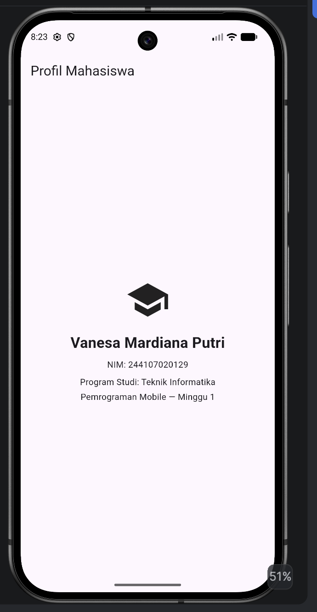

# Week 1 - Mobile Development Ecosystem & Flutter Refresh

## Deskripsi
Praktikum minggu pertama mengenai ekosistem mobile development dan pengenalan/penyegaran Flutter. Membuat aplikasi sederhana "Profil Mahasiswa" menggunakan widget dasar Flutter.

## Struktur Proyek
- `lib/Praktikum.dart` — kode hasil mengikuti langkah praktikum (tampilan profil dasar sesuai modul)
- `lib/main.dart` — kode mini assignment (profil mahasiswa dengan tambahan NIM dan program studi)

## Mini Assignment
Menambahkan informasi NIM dan satu informasi tambahan (Program Studi) pada tampilan profil mahasiswa menggunakan widget `Text` dan `SizedBox` sebagai spacing.

## Cara Menjalankan
```bash
flutter pub get
flutter run                          # menjalankan main.dart (assignment)
flutter run -t lib/Praktikum.dart    # menjalankan Praktikum.dart (versi tutorial)
```

## Screenshot


## Kendala Setup
Saat pertama kali menjalankan `flutter create`, nama folder proyek (`01-week-1-mobile-development-ecosystem-flutter-refresh`) ditolak karena mengandung angka di awal dan tanda strip (-), yang tidak valid sebagai nama package Dart. Solusinya adalah menggunakan flag `--project-name` untuk memberi nama package yang valid (`week1_flutter_refresh`) tanpa perlu mengubah nama folder itu sendiri.