# Week 2 — Declarative UI & Responsive Design

## Academic Overview Dashboard

Project ini merupakan tugas Week 2 pada mata kuliah Mobile Development menggunakan Flutter.

Pada tugas ini, aplikasi dashboard sederhana dikembangkan menjadi **Academic Overview Dashboard** untuk menampilkan informasi akademik mahasiswa.

Project ini menerapkan beberapa konsep Flutter seperti responsive design, `Row`, `Column`, `Expanded`, `Container`, reusable widget, light/dark mode, accessibility, dan widget testing.

---

## Informasi Mahasiswa

- **Nama:** Vanesa Mardiana Putri
- **NIM:** 244107020129
- **Kelas:** TI-3G

---

# Deskripsi Project

Academic Overview Dashboard merupakan aplikasi sederhana yang menampilkan informasi akademik mahasiswa dalam beberapa information card.

Informasi yang ditampilkan:

| Informasi | Nilai |
|---|---|
| Assignments | 8 |
| Attendance | 92% |
| Portfolio | Ready |
| Current Week | 02 |

Selain information card, terdapat profile header yang menampilkan nama, NIM, dan kelas mahasiswa.

Dashboard dibuat responsive sehingga tampilan berubah berdasarkan ukuran layar.

- Layar sempit → **1 kolom**
- Layar lebar → **2 kolom**

Aplikasi juga menyediakan toggle untuk berpindah antara **light mode** dan **dark mode**.

---

# Tujuan

Tujuan dari pengerjaan tugas ini adalah:

1. Membuat UI menggunakan widget Flutter.
2. Memahami penggunaan `Row`, `Column`, `Expanded`, dan `Container`.
3. Membuat layout responsive.
4. Menggunakan `LayoutBuilder` untuk menyesuaikan jumlah kolom.
5. Menggunakan light mode dan dark mode.
6. Membuat reusable widget.
7. Menambahkan accessibility menggunakan `Semantics`.
8. Membuat widget test untuk responsive layout.

---

# Implementasi

## 1. Profile Header

Profile header digunakan untuk menampilkan informasi mahasiswa.

```text
Vanesa Mardiana Putri
244107020129 • TI-3G
```

Widget yang digunakan antara lain:

- `Container`
- `Row`
- `Column`
- `Expanded`
- `CircleAvatar`

`Expanded` digunakan agar bagian informasi mahasiswa dapat menggunakan ruang yang tersedia.

---

## 2. Information Card

Dashboard memiliki empat information card:

```text
Assignments     8
Attendance      92%
Portfolio       Ready
Current Week    02
```

Card dibuat menggunakan reusable widget bernama `InfoCard`.

Contoh penggunaan:

```dart
const InfoCard(
  title: 'Assignments',
  value: '8',
)
```

Dengan reusable widget, struktur card tidak perlu dibuat berulang kali.

---

## 3. Responsive Layout

Responsive layout dibuat menggunakan `LayoutBuilder`.

Breakpoint dibuat sebagai constant:

```dart
const kWideBreakpoint = 700.0;
```

Jumlah kolom ditentukan berdasarkan lebar layar:

```dart
final columns =
    constraints.maxWidth >= kWideBreakpoint ? 2 : 1;
```

Artinya:

- Lebar layar **kurang dari 700 px** → **1 kolom**
- Lebar layar **700 px atau lebih** → **2 kolom**

### Narrow Layout

```text
Profile Header

Assignments
Attendance
Portfolio
Current Week
```

### Wide Layout

```text
Profile Header

Assignments     Attendance
Portfolio       Current Week
```

---

# 4. Light dan Dark Mode

Aplikasi memiliki light mode dan dark mode.

Toggle theme diletakkan pada `AppBar` menggunakan `CupertinoSwitch`.

State theme:

```dart
bool isDark = false;
```

Theme ditentukan berdasarkan state:

```dart
themeMode: isDark ? ThemeMode.dark : ThemeMode.light,
```

Ketika toggle diaktifkan, aplikasi berpindah ke dark mode.

---

# Eksperimen Warm-up + Screenshot Hasilnya

Sebelum pengembangan lebih lanjut, dilakukan beberapa eksperimen sederhana untuk memahami perilaku layout Flutter.

## 1. Menghapus `Expanded`

`Expanded` pada bagian nama di dalam profile header dihapus sementara untuk melihat perubahan layout.

Setelah eksperimen selesai, `Expanded` dikembalikan ke kode utama.

### Screenshot

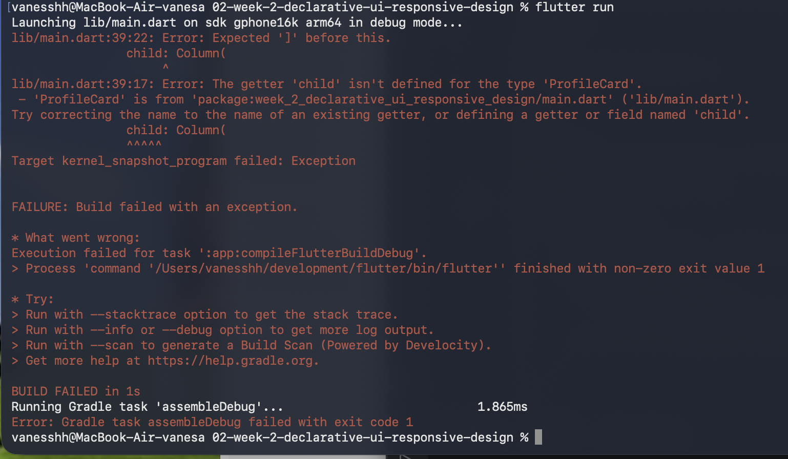

---

## 2. Mengubah `mainAxisSize`

Nilai:

```dart
mainAxisSize: MainAxisSize.min
```

diubah sementara menjadi nilai default:

```dart
MainAxisSize.max
```

Tujuannya untuk melihat perubahan tinggi layout.

Setelah eksperimen selesai, nilai dikembalikan ke:

```dart
MainAxisSize.min
```

### Screenshot

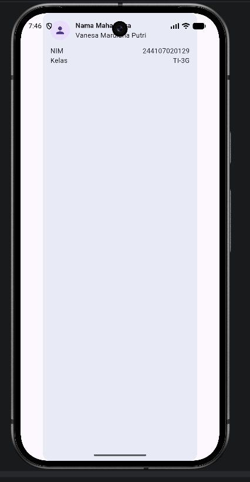

---

## 3. Menambahkan Email

Ditambahkan satu baris data menggunakan pola `Row` dan `Expanded`.

Contoh:

```dart
Row(
  children: [
    const Expanded(
      child: Text('Email'),
    ),
    const Text('vanesa@email.com'),
  ],
)
```

### Screenshot

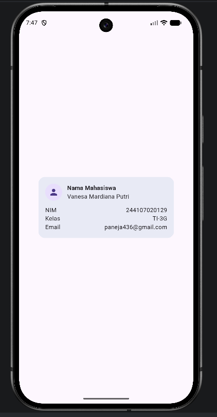

---

# Eksperimen Layout + Screenshot Hasilnya

## 1. Mengubah Breakpoint

Breakpoint `700.0` diubah sementara ke nilai lain untuk melihat perubahan jumlah kolom.

Setelah eksperimen, breakpoint dikembalikan ke:

```dart
const kWideBreakpoint = 700.0;
```

### Screenshot

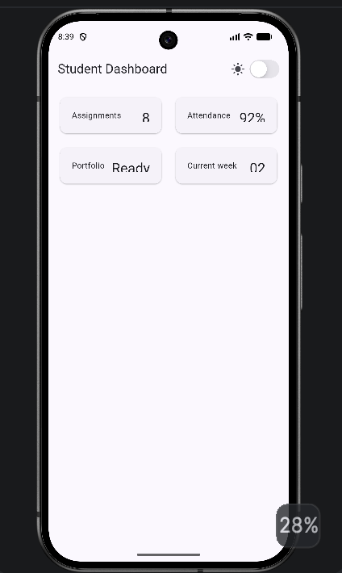

---

## 2. Mengubah Theme Mode

`themeMode` diubah sementara menjadi:

```dart
ThemeMode.dark
```

untuk melihat tampilan dark mode secara langsung.

Setelah eksperimen selesai, kode dikembalikan ke konfigurasi akhir.

### Screenshot

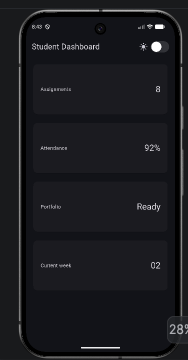

---

## 3. Menguji Ukuran Layar

Aplikasi diuji menggunakan ukuran layar yang berbeda.

Contoh pengujian:

```text
400 x 800  → 1 kolom
1200 x 800 → 2 kolom
```

### Screenshot

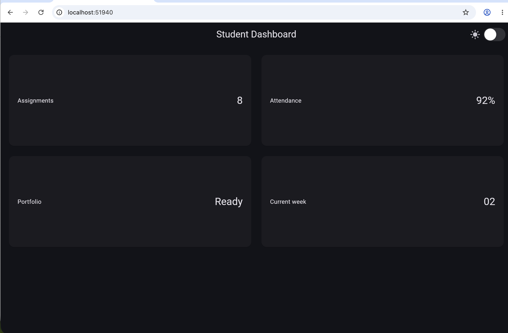

---

## 4. Menambahkan `Semantics`

`Semantics` digunakan pada informasi penting seperti information card dan toggle dark mode.

Tujuannya agar elemen penting memiliki label yang dapat dibaca oleh screen reader.

Contoh:

```dart
Semantics(
  label: '$title: $value',
  child: Card(
    ...
  ),
)
```

### Screenshot

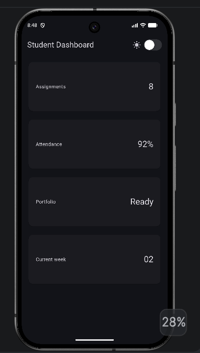

---

# Accessibility

Accessibility diterapkan menggunakan `Semantics`.

Pada information card digunakan label:

```dart
Semantics(
  label: '$title: $value',
  child: Card(
    ...
  ),
)
```

Dengan demikian informasi pada card dapat dibaca dengan lebih jelas oleh screen reader.

Toggle dark mode juga diberikan label:

```dart
Semantics(
  label: 'Toggle dark mode',
  child: CupertinoSwitch(
    ...
  ),
)
```

---

# Struktur Project

Struktur folder Week 2:

```text
02-week-2-declarative-ui-responsive-design/
│
├── README.md
│
├── lib/
│   ├── main.dart
│   └── responsive_dashboard.dart
│
├── test/
│   └── widget_test.dart
│
└── screenshots/
    ├── narrow.png
    ├── wide.png
    ├── EMU1.png
    ├── EMU2.png
    ├── EMU3.png
    ├── EL1.png
    ├── EL2.png
    ├── EL3.png
    ├── EL4.png
    ├── RC1.png
    ├── RC2.png
    ├── RC3.png
    └── flutter_test.png
```

Keterangan:

- `lib/main.dart` → aplikasi utama dashboard
- `lib/responsive_dashboard.dart` → file dashboard praktikum
- `test/widget_test.dart` → widget test
- `screenshots/narrow.png` → hasil layar sempit
- `screenshots/wide.png` → hasil layar lebar
- `README.md` → dokumentasi project

---

# Widget yang Digunakan

| Widget | Kegunaan |
|---|---|
| `MaterialApp` | Root aplikasi dan pengaturan theme |
| `Scaffold` | Struktur halaman |
| `AppBar` | Judul dan toggle theme |
| `LayoutBuilder` | Menyesuaikan layout berdasarkan ukuran layar |
| `Column` | Menyusun widget secara vertikal |
| `Row` | Menyusun widget secara horizontal |
| `Expanded` | Mengatur penggunaan ruang |
| `Container` | Membuat profile header |
| `GridView.count` | Menampilkan card dalam bentuk grid |
| `Card` | Membuat information card |
| `CircleAvatar` | Menampilkan icon profile |
| `CupertinoSwitch` | Toggle light/dark mode |
| `Semantics` | Accessibility |

---

# AI Prompt Challenge

AI digunakan setelah implementasi dasar selesai untuk membantu membandingkan alternatif teknis dan memverifikasi keputusan yang digunakan.

## 1. GridView vs LayoutBuilder + Column

### Prompt

> Compare GridView and LayoutBuilder + Column for creating a responsive dashboard in Flutter. Explain the trade-offs in terms of responsive layout, flexibility, scrolling, and accessibility. Recommend the most appropriate approach for this Academic Overview dashboard.

### Hasil Ringkas

`GridView` lebih ringkas, sudah mendukung scrolling, dan menyediakan spacing antar item.

`LayoutBuilder` digunakan untuk membaca ukuran area yang tersedia dan menentukan jumlah kolom.

Untuk dashboard dengan empat card yang seragam, kombinasi `LayoutBuilder` dan `GridView` lebih sesuai.

### Keputusan

Tetap menggunakan:

```text
LayoutBuilder
    ↓
Column
    ↓
ProfileHeader
    ↓
Expanded
    ↓
GridView
```

Pendekatan ini sesuai karena card memiliki struktur yang seragam dan profile header membutuhkan ruang sendiri.

---

## 2. Expanded dan Overflow

### Prompt

> Explain when Expanded causes overflow in Row or Column in Flutter. Show an example of failed code and explain how to fix it.

### Hasil Ringkas

`Expanded` digunakan untuk mengisi ruang yang tersedia di dalam `Row` atau `Column`.

Masalah dapat terjadi apabila parent memiliki constraint yang tidak sesuai atau ruang yang tersedia terlalu terbatas.

Pada pengerjaan dashboard, sempat terjadi overflow pada profile header ketika berada di area grid yang terlalu sempit.

### Keputusan

Profile header dipisahkan dari `GridView` sehingga struktur menjadi:

```text
Column
├── ProfileHeader
└── Expanded
    └── GridView
```

Dengan struktur tersebut, profile header mendapatkan ruang sendiri dan grid menggunakan sisa ruang.

---

## 3. Verification

### Prompt

> Verify whether the responsive layout, accessibility implementation, and Flutter widgets used in the dashboard are appropriate and stable.

### Hasil Ringkas

Hasil verifikasi menunjukkan bahwa:

- Layout dapat menyesuaikan layar sempit dan lebar.
- Accessibility menggunakan `Semantics`.
- Widget yang digunakan merupakan widget Flutter stable.
- Breakpoint digunakan secara konsisten.
- Layout diuji pada ukuran `400 x 800` dan `1200 x 800`.

### Keputusan

`LayoutBuilder`, `GridView`, `CupertinoSwitch`, dan `Semantics` tetap digunakan karena sesuai dengan kebutuhan project.

Breakpoint project tetap menggunakan:

```dart
const kWideBreakpoint = 700.0;
```

---

# Ringkasan Keputusan AI Challenge

| Aspek | Keputusan |
|---|---|
| Responsive layout | `LayoutBuilder` + `GridView` |
| Scroll | `GridView` |
| Reusable card | `InfoCard` |
| Theme | `Theme.of(context)` |
| Breakpoint | `kWideBreakpoint = 700.0` |
| Accessibility | `Semantics` |
| Theme toggle | `CupertinoSwitch` |

Rekomendasi AI tidak langsung digunakan tanpa pengujian. Hasilnya dibandingkan dengan kebutuhan project dan diverifikasi melalui running aplikasi, widget test, dan `flutter analyze`.

---

# Screenshot Hasil AI Prompt Challenge

Screenshot proses AI Prompt Challenge disimpan sebagai dokumentasi.

### AI Prompt 1

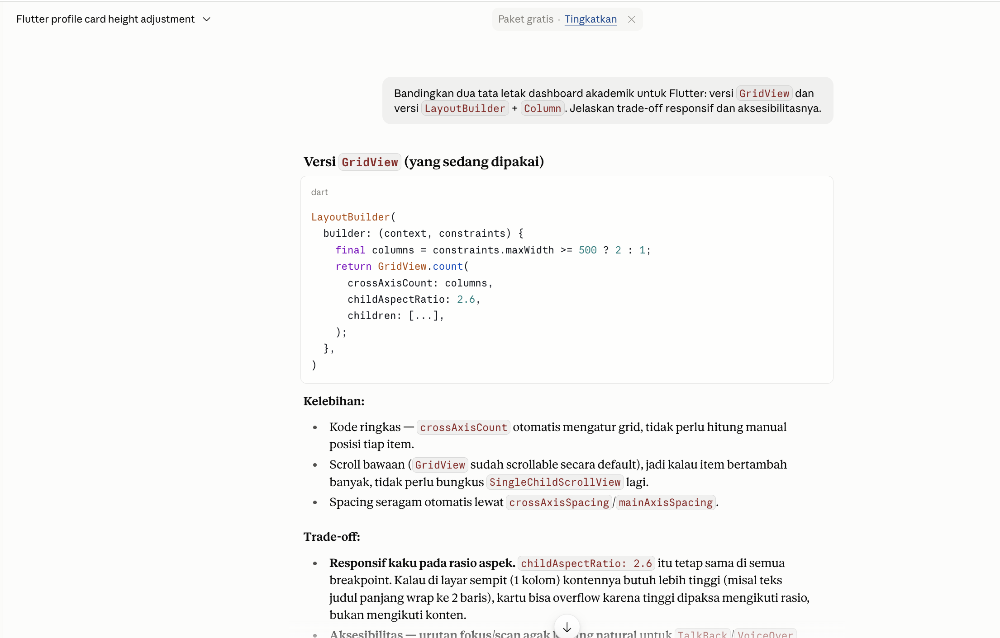

### AI Prompt 2

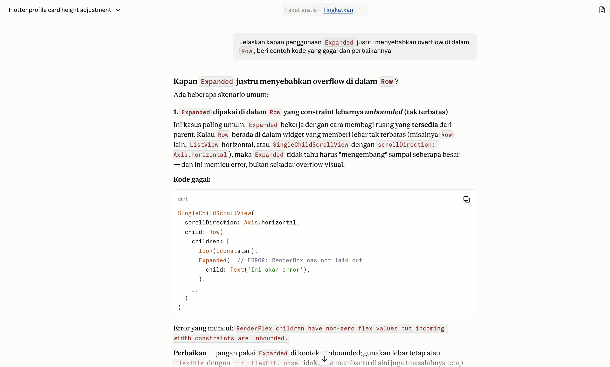

### AI Prompt 3

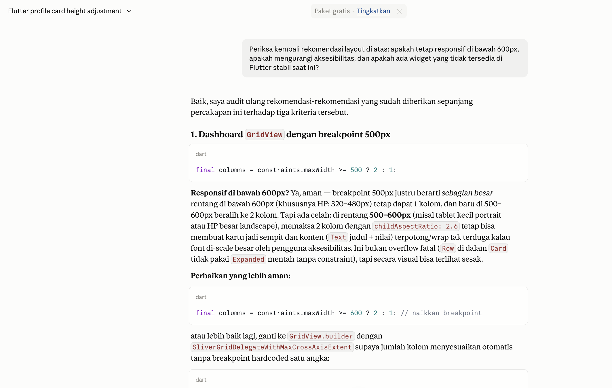

---

# Refactoring

## 1. Membuat `InfoCard` sebagai Reusable Widget

Information card dibuat menjadi reusable widget:

```dart
class InfoCard extends StatelessWidget {
  const InfoCard({
    required this.title,
    required this.value,
    super.key,
  });

  final String title;
  final String value;
}
```

Dengan demikian struktur card dapat digunakan kembali.

### Screenshot

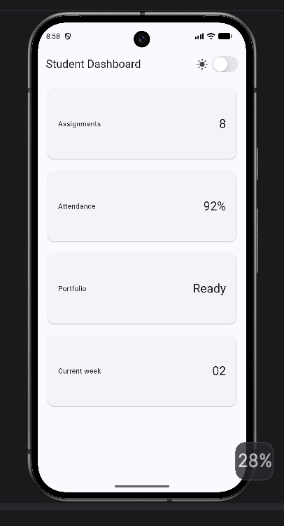

---

## 2. Menggunakan `Theme.of(context)`

Styling menggunakan `Theme.of(context)`.

Contoh:

```dart
Theme.of(context).textTheme.titleLarge
```

dan:

```dart
Theme.of(context).colorScheme.surfaceContainerHighest
```

Penggunaan theme membuat tampilan dapat mengikuti light mode dan dark mode.

### Screenshot

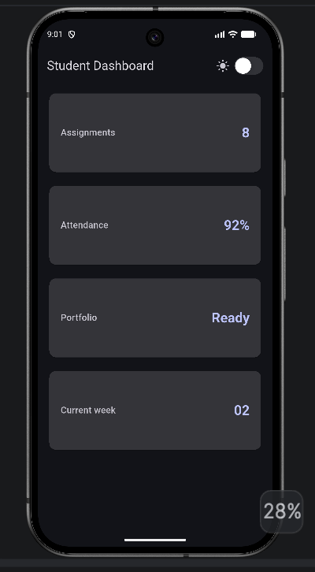

---

## 3. Membuat Breakpoint sebagai Constant

Breakpoint dibuat menjadi satu constant:

```dart
const kWideBreakpoint = 700.0;
```

Constant tersebut digunakan oleh `LayoutBuilder`.

### Screenshot


---

# Testing

Widget test digunakan untuk mengecek responsive layout.

## Narrow Screen

Ukuran:

```text
400 x 800
```

Expected:

```text
1 column
```

Test:

```dart
expect(width, lessThan(700));
```

---

## Wide Screen

Ukuran:

```text
1200 x 800
```

Expected:

```text
2 columns
```

Test:

```dart
expect(width, greaterThan(500));
```

---

## Menjalankan Test

Gunakan:

```bash
flutter test
```

Hasil pengujian:

```text
00:01 +2: All tests passed!
```

Artinya kedua widget test berhasil dijalankan.

### Screenshot

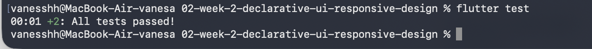

---

# Flutter Analyze

Untuk melakukan pengecekan static analysis:

```bash
flutter analyze
```

Hasil:

```text
No issues found!
```

---

# Hasil dan Output Aplikasi

Setelah dijalankan, aplikasi menampilkan:

```text
Academic Overview

[ Profile ]
Vanesa Mardiana Putri
244107020129 • TI-3G

[ Assignments ]    8
[ Attendance ]     92%
[ Portfolio ]      Ready
[ Current Week ]   02
```

Pada bagian kanan AppBar terdapat toggle untuk berpindah antara light mode dan dark mode.

---

# Hasil Narrow Layout

Pada layar sempit dashboard menggunakan satu kolom.

```text
400 x 800

Profile Header

Assignments
Attendance
Portfolio
Current Week
```

### Screenshot

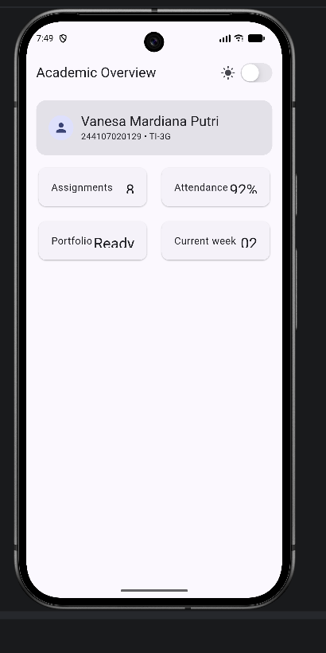

---

# Hasil Wide Layout

Pada layar lebar dashboard menggunakan dua kolom.

```text
1200 x 800

Profile Header

Assignments     Attendance
Portfolio       Current Week
```

### Screenshot

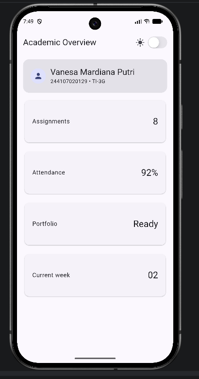

---

# Hasil Light dan Dark Mode

Aplikasi dapat berpindah antara light mode dan dark mode menggunakan `CupertinoSwitch`.

Light mode:

```text
Light Mode
```

Dark mode:

```text
Dark Mode
```

Konfigurasi theme:

```dart
themeMode: isDark ? ThemeMode.dark : ThemeMode.light,
```

### Screenshot Dark Mode

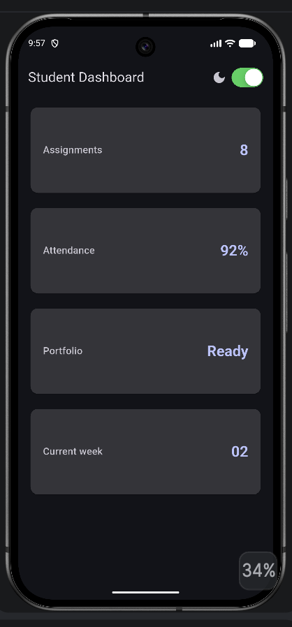

---

# Cara Menjalankan Project

## 1. Masuk ke Folder Project

Dari repository utama:

```bash
cd 02-week-2-declarative-ui-responsive-design
```

---

## 2. Menjalankan Main Project

```bash
flutter run
```

---

## 3. Menjalankan Responsive Dashboard di Chrome

Karena file dashboard praktikum berada di:

```text
lib/responsive_dashboard.dart
```

jalankan:

```bash
flutter run -t lib/responsive_dashboard.dart -d chrome
```

---

## 4. Menjalankan di Android Emulator

```bash
flutter run -t lib/responsive_dashboard.dart -d emulator-5554
```

---

## 5. Menjalankan Widget Test

```bash
flutter test
```

---

## 6. Menjalankan Flutter Analyze

```bash
flutter analyze
```

---

# Checklist Verifikasi

- [x] `flutter analyze` tidak menghasilkan error.
- [x] `flutter test` lulus semua widget test responsif.
- [x] Aplikasi dapat dijalankan pada ukuran layar sempit dan lebar.
- [x] Dark mode memiliki kontras dan teks yang terbaca.
- [x] Struktur widget dapat dijelaskan saat code review.
- [x] Screenshot, folder `test/`, dan README sudah tersimpan pada folder tugas Week 2.

---

# Refleksi + Jawaban

## 1. Apa perbedaan imperative dan declarative saat membangun UI?

Pada pendekatan imperative, developer menjelaskan langkah-langkah untuk mengubah tampilan.

Pada pendekatan declarative seperti Flutter, developer menjelaskan kondisi UI yang diinginkan berdasarkan state.

Pada project ini, tampilan theme berubah berdasarkan nilai `isDark`.

---

## 2. Kapan `Expanded` membantu dan kapan menyebabkan layout error?

`Expanded` membantu ketika widget perlu menggunakan ruang yang tersedia di dalam `Row` atau `Column`.

Namun, `Expanded` dapat menyebabkan error apabila parent memiliki constraint yang tidak sesuai atau ruang yang tersedia terlalu terbatas.

Pada project ini, masalah layout pada profile header diselesaikan dengan memisahkan profile header dari `GridView`.

---

## 3. Bagaimana breakpoint dan theme memengaruhi pengalaman pengguna?

Breakpoint menentukan kapan layout berubah berdasarkan ukuran layar.

Pada project ini:

```text
< 700 px → 1 kolom
≥ 700 px → 2 kolom
```

Dengan demikian informasi tetap mudah dibaca pada layar yang berbeda.

Theme memberikan pilihan kepada pengguna untuk menggunakan light mode atau dark mode.

---

## 4. Apa yang diverifikasi dari rekomendasi AI?

Rekomendasi AI dibandingkan dengan kebutuhan project dan kemudian diverifikasi melalui implementasi.

Hal yang diverifikasi meliputi:

- responsive layout
- accessibility
- penggunaan widget Flutter
- widget testing
- `flutter analyze`
- hasil running pada ukuran layar yang berbeda

---

# Kesimpulan

Pada tugas Week 2, dashboard Flutter dikembangkan menjadi **Academic Overview Dashboard** yang memiliki responsive layout, light/dark mode, reusable widget, accessibility, dan widget testing.

Konsep yang diterapkan meliputi:

- `Row`
- `Column`
- `Expanded`
- `Container`
- `LayoutBuilder`
- `GridView`
- `Card`
- `InfoCard`
- `CupertinoSwitch`
- `Semantics`
- Light/Dark Theme
- Widget Testing

Responsive layout menggunakan breakpoint:

```dart
const kWideBreakpoint = 700.0;
```

Pada layar sempit dashboard menggunakan satu kolom, sedangkan pada layar lebar menggunakan dua kolom.

Refactoring dilakukan dengan membuat `InfoCard` sebagai reusable widget, menggunakan `Theme.of(context)`, dan membuat breakpoint menjadi constant.

Pengujian dilakukan menggunakan:

```bash
flutter test
```

dan:

```bash
flutter analyze
```

Screenshot hasil running dan eksperimen disimpan pada folder `screenshots/` sebagai dokumentasi project.