# Week 3 — Navigation & State Management

## 1. Selamat Datang

Project ini merupakan tugas Week 3 pada mata kuliah Mobile Development menggunakan Flutter.

Pada minggu ini dipelajari konsep navigasi multi-page menggunakan GoRouter, state management menggunakan Riverpod, serta pengelolaan state asynchronous menggunakan AsyncValue.

---

# Tujuan Pembelajaran

Setelah menyelesaikan codelab ini, mahasiswa mampu:

1. Menjelaskan konsep navigasi, route, dan perbedaan Navigator 1.0 dengan GoRouter.
2. Menerapkan navigasi multi-page dengan GoRouter, termasuk passing argument dan deep link sederhana.
3. Menjelaskan mengapa state management diperlukan dan cara kerja Riverpod.
4. Menggunakan `AsyncValue` untuk menangani state loading, error, dan success.
5. Membangun aplikasi ToDo dengan navigasi dan Riverpod.
6. Melakukan verifikasi menggunakan widget test dan `flutter analyze`.

---

# Persiapan

Persiapan yang digunakan:

- Laptop/PC
- Koneksi internet
- Repository portfolio GitHub/GitLab
- Flutter SDK
- VS Code dengan ekstensi Flutter dan Dart
- Android Emulator atau perangkat fisik
- Pemahaman materi Week 1–2, seperti Dart dasar, widget, `StatelessWidget`, `StatefulWidget`, layout, dan theme.

---

# Konsep Navigasi dan GoRouter

## Navigation Dasar di Flutter

Navigasi adalah mekanisme untuk berpindah antar layar.

Di Flutter, setiap layar dapat dianggap sebagai route yang dikelola oleh `Navigator`.

Contoh Navigator 1.0:

```dart
Navigator.push(
  context,
  MaterialPageRoute(
    builder: (context) => const DetailPage(),
  ),
);
```

Cara ini cukup sederhana untuk aplikasi kecil, tetapi pada aplikasi yang lebih besar route dapat menjadi sulit dikelola, terutama ketika membutuhkan deep link atau redirect.

---

## GoRouter

GoRouter merupakan router deklaratif yang digunakan untuk mengatur navigasi aplikasi.

Beberapa konsep penting:

| Konsep | Penjelasan |
|---|---|
| `GoRoute` | Mendefinisikan path dan halaman tujuan |
| `context.go()` | Berpindah route dengan mengganti lokasi saat ini |
| `context.push()` | Menambahkan route baru ke stack |
| `path parameter` | Nilai dinamis pada path seperti `/detail/:id` |
| `extra` | Mengirim objek ke route lain |
| `redirect` | Digunakan untuk guard atau redirect navigasi |

---

# Praktikum 1 — Aplikasi Multi-page dengan GoRouter

Project Week 3 dibuat di dalam folder:

```text
03-week-3-navigation-state-management/
```

Nama package Flutter:

```text
week3_navigation
```

Dependency yang digunakan:

```yaml
go_router: ^18.0.1
```

---

## Struktur Folder

```text
lib/
├── main.dart
└── pages/
    ├── home_page.dart
    └── detail_page.dart
```

Folder `pages/` dibuat secara manual untuk memisahkan halaman Home dan Detail.

---

## 1. Router

Router didefinisikan pada `lib/main.dart`.

```dart
import 'package:flutter/material.dart';
import 'package:go_router/go_router.dart';
import 'pages/detail_page.dart';
import 'pages/home_page.dart';

void main() => runApp(const MyApp());

final _router = GoRouter(
  initialLocation: '/',
  routes: [
    GoRoute(
      path: '/',
      builder: (context, state) => const HomePage(),
      routes: [
        GoRoute(
          path: 'detail/:id',
          builder: (context, state) => DetailPage(
            id: state.pathParameters['id']!,
          ),
        ),
      ],
    ),
  ],
);

class MyApp extends StatelessWidget {
  const MyApp({super.key});

  @override
  Widget build(BuildContext context) {
    return MaterialApp.router(
      title: 'Week 3 - Navigation',
      routerConfig: _router,
      theme: ThemeData(
        colorSchemeSeed: Colors.indigo,
        useMaterial3: true,
      ),
    );
  }
}
```

Pada GoRouter digunakan `MaterialApp.router`, bukan `MaterialApp` biasa.

---

## 2. Halaman Home

File:

```text
lib/pages/home_page.dart
```

Kode:

```dart
import 'package:flutter/material.dart';
import 'package:go_router/go_router.dart';

class HomePage extends StatelessWidget {
  const HomePage({super.key});

  @override
  Widget build(BuildContext context) {
    return Scaffold(
      appBar: AppBar(
        title: const Text('Home'),
      ),
      body: ListView.builder(
        itemCount: 10,
        itemBuilder: (context, index) => ListTile(
          title: Text('Item ${index + 1}'),
          onTap: () => context.go('/detail/${index + 1}'),
        ),
      ),
    );
  }
}
```

Halaman Home menampilkan 10 item.

Ketika item dipilih, aplikasi berpindah ke halaman detail sesuai ID item.

---

## 3. Halaman Detail

File:

```text
lib/pages/detail_page.dart
```

Kode:

```dart
import 'package:flutter/material.dart';

class DetailPage extends StatelessWidget {
  final String id;

  const DetailPage({
    super.key,
    required this.id,
  });

  @override
  Widget build(BuildContext context) {
    return Scaffold(
      appBar: AppBar(
        title: Text('Detail $id'),
      ),
      body: Center(
        child: Text(
          'Anda membuka item dengan id: $id',
        ),
      ),
    );
  }
}
```

Nilai `id` diambil dari:

```dart
state.pathParameters['id']!
```

---

## 4. Hasil Praktikum GoRouter

Hasil pengujian:

- Halaman Home dapat menampilkan daftar item.
- Item dapat dipilih untuk membuka halaman Detail.
- ID item diteruskan melalui path parameter.
- Tombol back dapat digunakan untuk kembali.
- Halaman detail dapat diakses langsung melalui path.

Contoh path:

```text
/detail/1
/detail/5
/detail/10
```

### Screenshot

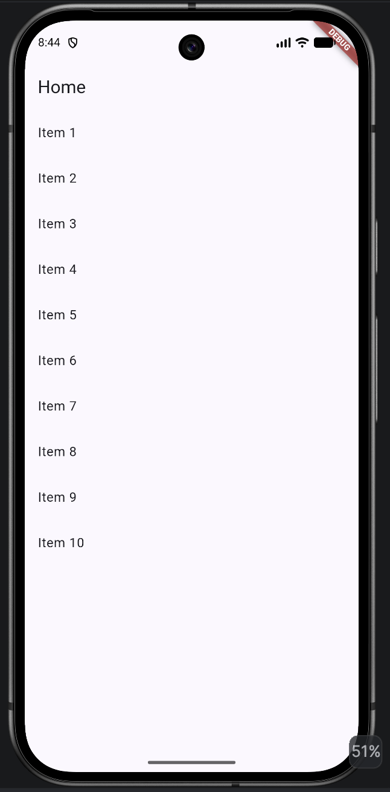

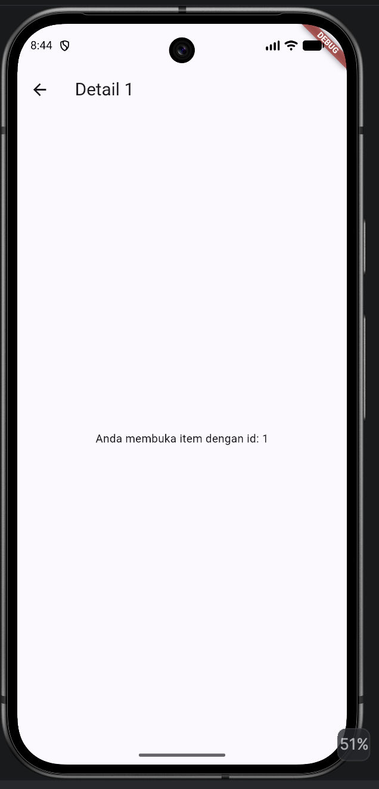

---

# 2. State Management dengan Riverpod

## Mengapa Perlu State Management?

`setState` cukup digunakan untuk state lokal pada satu widget.

Namun, ketika state harus digunakan oleh beberapa halaman atau beberapa widget, penggunaan `setState` dapat membuat kode menjadi lebih rumit.

State management digunakan agar state dapat dikelola secara terpusat dan UI dapat dibangun berdasarkan state yang tersedia.

Pada project ini digunakan Riverpod.

---

# Konsep Inti Riverpod

| Konsep | Penjelasan |
|---|---|
| `ProviderScope` | Wadah yang menyimpan provider |
| `Provider` | Menyediakan nilai read-only |
| `Notifier` | Mengelola state yang dapat berubah |
| `NotifierProvider` | Menyediakan `Notifier` ke UI |
| `ConsumerWidget` | Widget yang dapat membaca provider |
| `ref.watch` | Membaca state dan rebuild saat berubah |
| `ref.read` | Membaca atau memanggil provider tanpa berlangganan |

---

# Praktikum 2 — Aplikasi ToDo dengan Riverpod

Dependency yang digunakan:

```bash
flutter pub add flutter_riverpod
```

---

## 1. ProviderScope

Aplikasi dibungkus menggunakan `ProviderScope`.

```dart
import 'package:flutter/material.dart';
import 'package:flutter_riverpod/flutter_riverpod.dart';
import 'pages/todo_page.dart';

void main() => runApp(
      const ProviderScope(
        child: MyApp(),
      ),
    );

class MyApp extends StatelessWidget {
  const MyApp({super.key});

  @override
  Widget build(BuildContext context) {
    return MaterialApp(
      title: 'Week 3 - ToDo',
      theme: ThemeData(
        colorSchemeSeed: Colors.teal,
        useMaterial3: true,
      ),
      home: const TodoPage(),
    );
  }
}
```

---

## 2. State dan Provider

File:

```text
lib/providers/todo_provider.dart
```

Kode:

```dart
import 'package:flutter_riverpod/flutter_riverpod.dart';

class Todo {
  Todo(
    this.title, {
    this.done = false,
  });

  final String title;
  final bool done;

  Todo copyWith({
    String? title,
    bool? done,
  }) =>
      Todo(
        title ?? this.title,
        done: done ?? this.done,
      );
}

class TodoListNotifier extends Notifier<List<Todo>> {
  @override
  List<Todo> build() => const [];

  void add(String title) {
    state = [
      ...state,
      Todo(title),
    ];
  }

  void toggle(int index) {
    final todos = [...state];

    todos[index] = todos[index].copyWith(
      done: !todos[index].done,
    );

    state = todos;
  }

  void remove(int index) {
    state = [...state]..removeAt(index);
  }
}

final todoListProvider =
    NotifierProvider<TodoListNotifier, List<Todo>>(
  TodoListNotifier.new,
);
```

State tidak diubah dengan:

```dart
state.add(...)
```

Karena perubahan state menggunakan pola immutable.

---

## 3. TodoPage

File:

```text
lib/pages/todo_page.dart
```

Kode menggunakan `ConsumerWidget`:

```dart
final todos = ref.watch(todoListProvider);
```

Untuk memanggil method provider digunakan:

```dart
ref.read(todoListProvider.notifier)
```

`ref.watch` digunakan pada `build`, sedangkan `ref.read` digunakan pada callback seperti tombol tambah, toggle, dan delete.

### Hasil Praktikum

Aplikasi ToDo dapat:

- menampilkan daftar tugas,
- menambahkan tugas,
- menandai tugas selesai,
- menghapus tugas.

### Screenshot

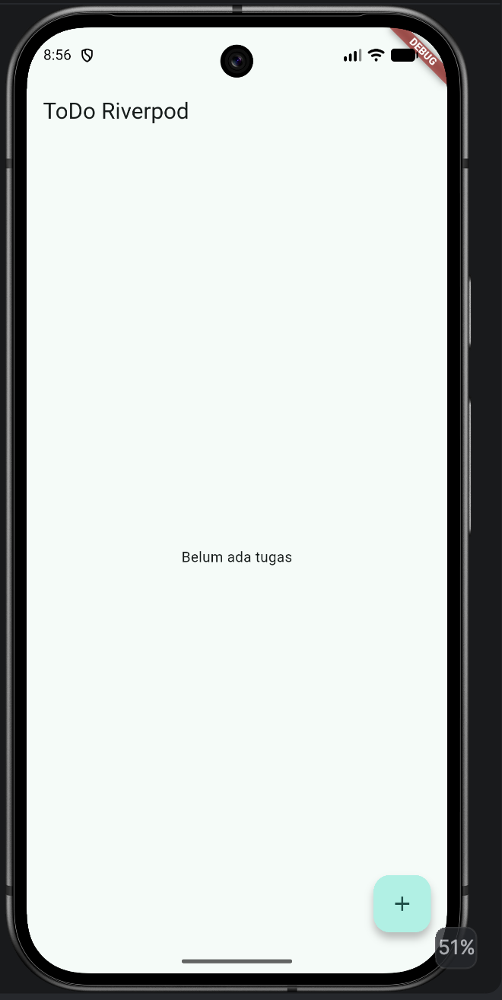
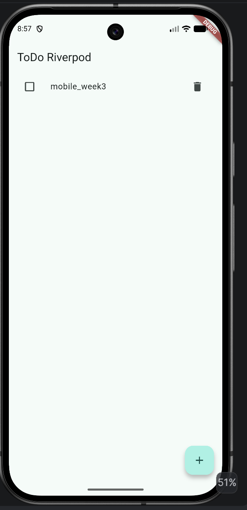
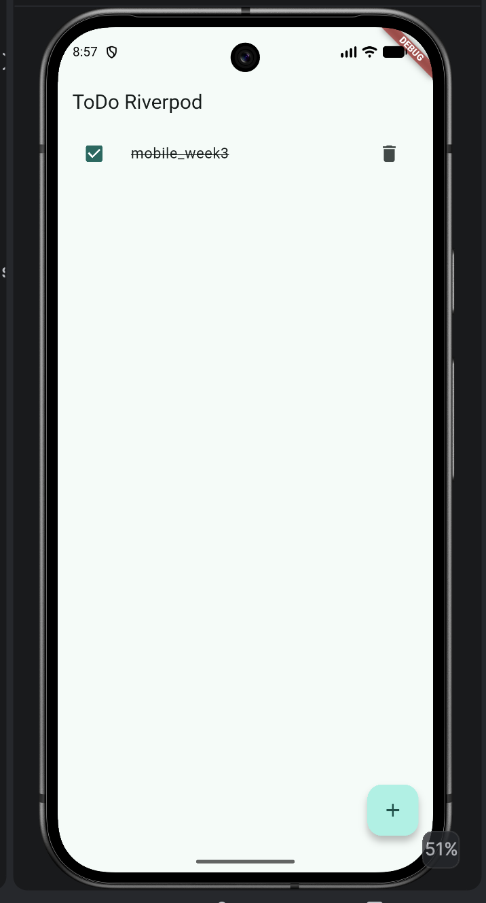

---

# 3. AsyncValue — Loading, Error, Success

## Masalah State Asinkron

Data pada aplikasi dapat berasal dari proses asynchronous seperti API atau database.

UI harus menangani beberapa kemungkinan:

```text
Loading
Error
Success
```

Jika ketiga kondisi tersebut dibuat dengan banyak boolean, kondisi state dapat menjadi sulit dikontrol.

---

## AsyncValue

Riverpod menyediakan `AsyncValue` untuk memodelkan state asynchronous.

Contoh:

```dart
class ProductsNotifier extends AsyncNotifier<List<String>> {
  @override
  Future<List<String>> build() async {
    await Future.delayed(
      const Duration(seconds: 2),
    );

    return [
      'Keyboard',
      'Mouse',
      'Monitor',
    ];
  }
}
```

Provider:

```dart
final productsProvider =
    AsyncNotifierProvider<ProductsNotifier, List<String>>(
  ProductsNotifier.new,
);
```

---

## Menggunakan AsyncValue

Pada UI dapat digunakan:

```dart
productsAsync.when(
  loading: () => const Center(
    child: CircularProgressIndicator(),
  ),
  error: (err, stack) => Center(
    child: Text('Gagal memuat: $err'),
  ),
  data: (products) => ListView.builder(
    itemCount: products.length,
    itemBuilder: (context, index) {
      return ListTile(
        title: Text(products[index]),
      );
    },
  ),
)
```

Dengan `when`, tiga kondisi utama dapat ditangani:

```text
loading → spinner
error   → pesan error + retry
success → data
```

### Screenshot

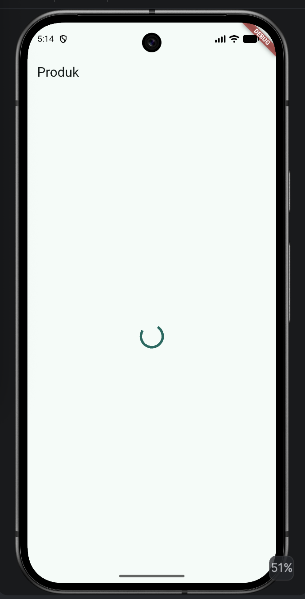

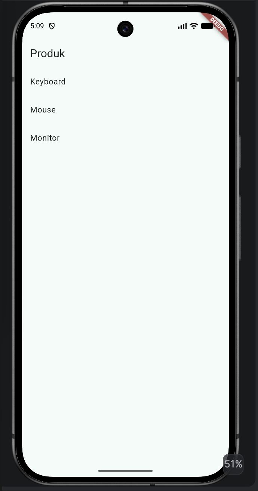

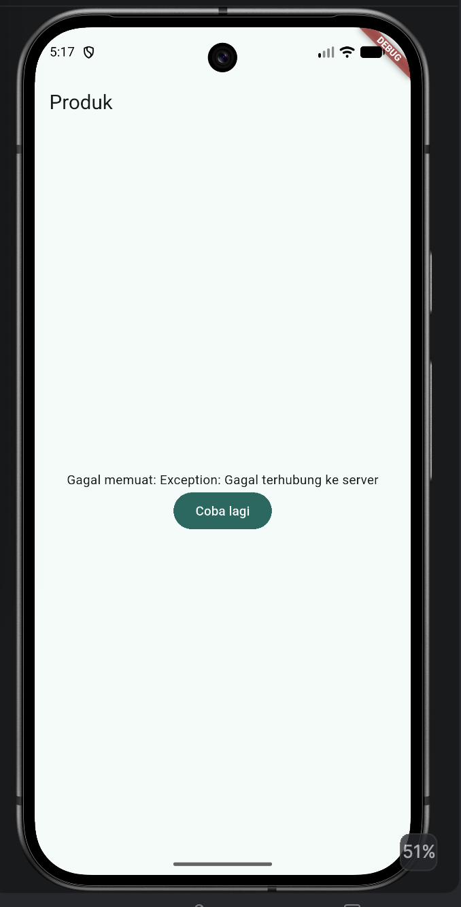

---

# Praktikum 3 — Uji Ketiga State

## 1. Loading

Kode dijalankan dengan delay 2 detik.

Hasil:

- spinner tampil selama proses loading,
- setelah proses selesai data ditampilkan.

### Screenshot


---

## 2. Error

`build()` diubah sementara menjadi:

```dart
throw Exception('Gagal terhubung ke server');
```

Hasil:

- pesan error muncul,
- tombol `Coba lagi` dapat digunakan.

### Screenshot


---

## 3. Retry dan Success

Ketika tombol `Coba lagi` ditekan:

```dart
ref.invalidate(productsProvider);
```

Provider dijalankan kembali.

Setelah kode dipulihkan, state success kembali tampil.

### Screenshot


---

## 4. Refleksi Stale Data

Menampilkan data lama atau stale data dengan indikator refresh terkadang lebih baik daripada mengosongkan layar karena pengguna masih dapat melihat informasi yang sudah tersedia selama data baru sedang dimuat.

Pola ini berguna ketika data lama masih relevan dan perubahan data tidak harus langsung terlihat. Contohnya adalah aplikasi berita, dashboard, atau daftar produk yang masih dapat ditampilkan sambil melakukan refresh di background.

Dengan cara ini, pengguna tidak melihat halaman kosong dan pengalaman penggunaan menjadi lebih nyaman.

---

# Pola yang Sering Keliru

Beberapa kesalahan yang perlu diperhatikan:

1. Menggunakan `ref.watch` di dalam callback.
2. Mengubah state langsung tanpa membuat data baru.
3. Tidak menangani UI error saat proses asynchronous gagal.
4. Menggunakan `setState` untuk state yang dibutuhkan lintas halaman.

---

# 4. AI Challenge

Dijelaskan pada folder docs/

---

# 5. Refactoring dan Testing

## Refactoring Challenge

### 1. TodoTile

Widget baris ToDo dipisahkan menjadi widget tersendiri bernama:

```text
TodoTile
```

Tujuannya agar `build()` pada halaman ToDo lebih pendek dan lebih mudah diuji.

### Screenshot

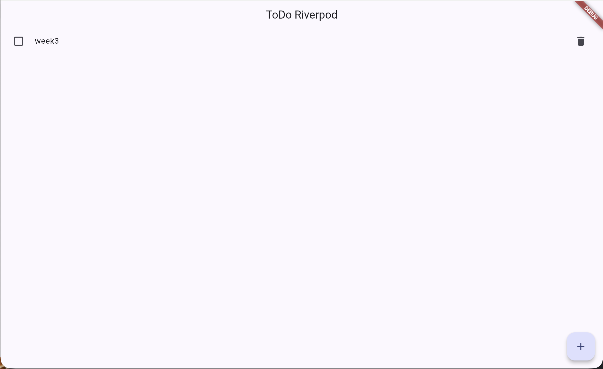

---

## 2. Provider Filter

Logika filter dipisahkan menjadi provider turunan yang membaca:

```text
todoListProvider
```

Contoh kebutuhan:

```text
Menampilkan hanya tugas yang belum selesai.
```

Dengan demikian logika filter tidak diletakkan langsung di UI.

### Screenshot

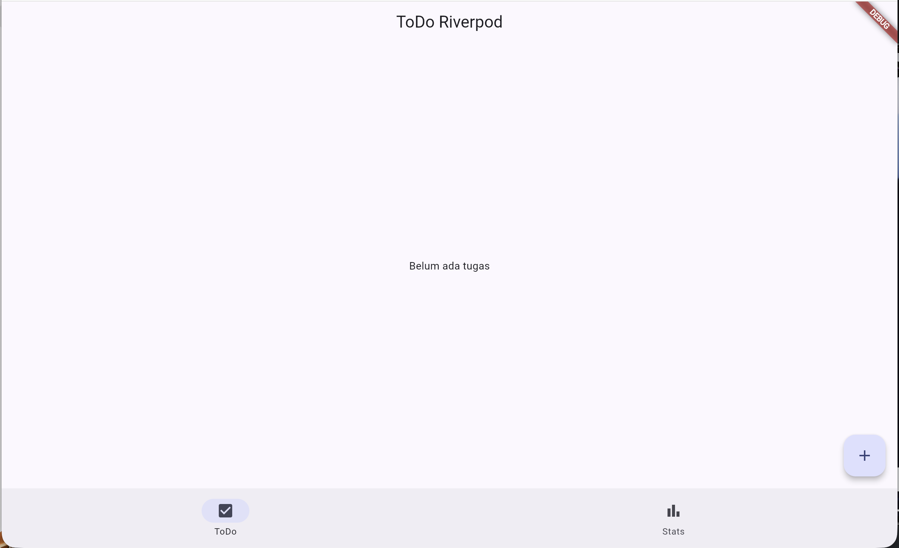

---

## 3. Integrasi GoRouter

Aplikasi ToDo diintegrasikan dengan GoRouter.

Route yang digunakan:

```text
/       → daftar ToDo
/stats  → halaman statistik
```

Navigation bar digunakan untuk berpindah halaman.

### Screenshot

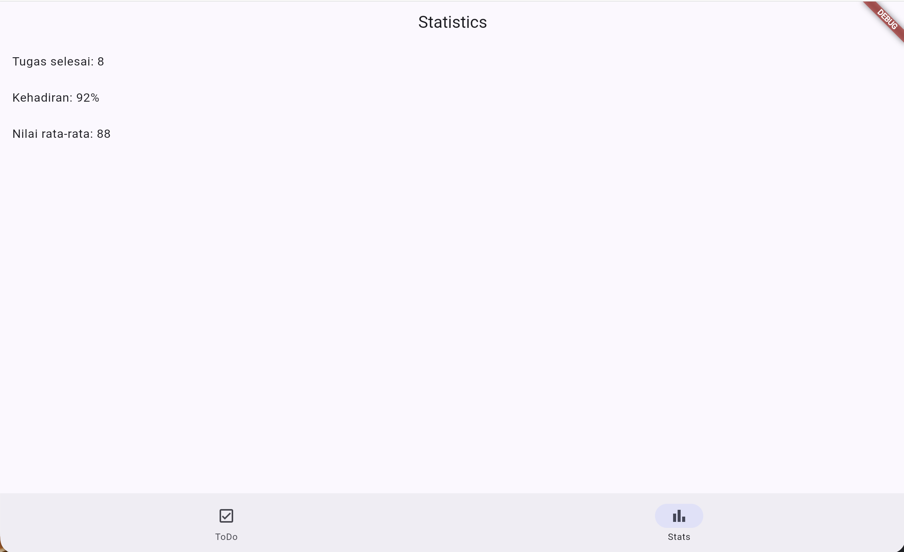

---

# Testing

Widget test digunakan untuk memastikan UI dapat bereaksi terhadap perubahan state provider.

Contoh:

```dart
import 'package:flutter_test/flutter_test.dart';
import 'package:flutter_riverpod/flutter_riverpod.dart';
import 'package:week3_todo/main.dart';

void main() {
  testWidgets('menambah tugas baru', (tester) async {
    await tester.pumpWidget(
      const ProviderScope(
        child: MyApp(),
      ),
    );

    expect(
      find.text('Belum ada tugas'),
      findsOneWidget,
    );

    await tester.tap(
      find.byIcon(Icons.add),
    );

    await tester.pumpAndSettle();

    await tester.enterText(
      find.byType(TextField),
      'Kerjakan PR minggu 3',
    );

    await tester.tap(
      find.text('Tambah'),
    );

    await tester.pump();

    expect(
      find.text('Kerjakan PR minggu 3'),
      findsOneWidget,
    );
  });
}
```

---

# Menjalankan Testing

Gunakan:

```bash
flutter analyze
```

Kemudian:

```bash
flutter test
```

### Screenshot

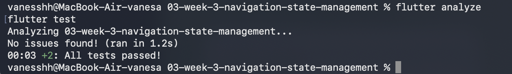

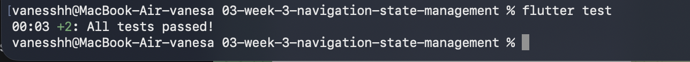

---

# Checklist Verifikasi Mandiri

- [x] Navigasi GoRouter bekerja.
- [x] Dapat berpindah halaman dan kembali menggunakan back.
- [x] Path detail dapat diakses langsung.
- [x] `ProviderScope` membungkus root aplikasi.
- [x] State ToDo dapat digunakan lintas halaman.
- [x] AsyncValue menangani loading, error, dan success.
- [x] `flutter analyze` tidak menghasilkan issue.
- [x] Semua test lulus.
- [x] Hasil AI diverifikasi dan didokumentasikan pada folder `docs/`.

---

# Hasil dan Output

## GoRouter

Aplikasi dapat berpindah antara halaman Home dan Detail.

Path berubah sesuai halaman yang aktif.

Contoh:

```text
/
 /detail/1
 /detail/2
 /detail/3
```

---

## Riverpod

Aplikasi ToDo dapat:

- menambahkan tugas,
- mengubah status tugas,
- menghapus tugas,
- mempertahankan state selama aplikasi berjalan.

---

## AsyncValue

Aplikasi dapat menangani:

```text
Loading
Error
Success
```

sehingga UI tidak hanya menampilkan data ketika request berhasil.

---

# Refleksi

## 1. Kapan `setState` masih cukup, dan kapan state harus naik ke Riverpod?

`setState` masih cukup ketika state hanya digunakan oleh satu widget atau satu halaman.

Riverpod lebih cocok ketika state digunakan oleh beberapa widget atau halaman dan logika state perlu dipisahkan dari UI.

---

## 2. Apa perbedaan `context.go` dan `context.push`?

`context.go()` digunakan untuk berpindah ke route tertentu dengan mengganti lokasi saat ini.

`context.push()` digunakan untuk menambahkan route baru ke navigation stack.

Pada navigasi yang membutuhkan halaman detail, `push` cocok digunakan ketika halaman sebelumnya masih ingin dipertahankan pada stack. Sedangkan `go` cocok digunakan untuk berpindah langsung ke lokasi tertentu.

---

## 3. Bagaimana `AsyncValue` mencegah bug dibanding tiga boolean?

`AsyncValue` menggabungkan kondisi loading, error, dan success dalam satu state.

Dengan begitu, kemungkinan kondisi boolean yang tidak konsisten dapat dikurangi.

UI juga dapat menangani ketiga kondisi tersebut dengan pola yang lebih terstruktur menggunakan `when`.

---

## 4. Bagian mana dari hasil AI yang diperbaiki, dan mengapa?

Hasil AI tidak langsung digunakan.

Kode diperiksa kembali agar sesuai dengan versi Riverpod yang digunakan, menggunakan pola `Notifier`, `AsyncNotifier`, `ConsumerWidget`, dan state immutable.

Selain itu, hasil implementasi diuji dengan `flutter analyze` dan `flutter test` untuk memastikan kode dapat dijalankan.

---

# Kesimpulan

Pada Week 3 dipelajari navigasi multi-page menggunakan GoRouter dan state management menggunakan Riverpod.

GoRouter digunakan untuk mengatur route, path parameter, dan perpindahan antar halaman.

Riverpod digunakan untuk mengelola state ToDo sehingga state dapat dipisahkan dari widget dan digunakan oleh beberapa bagian aplikasi.

AsyncValue digunakan untuk menangani state asynchronous dalam tiga kondisi utama, yaitu loading, error, dan success.

Selain implementasi, dilakukan juga AI Challenge, refactoring, dan testing untuk memastikan kode dapat berjalan dan sesuai dengan kebutuhan tugas.