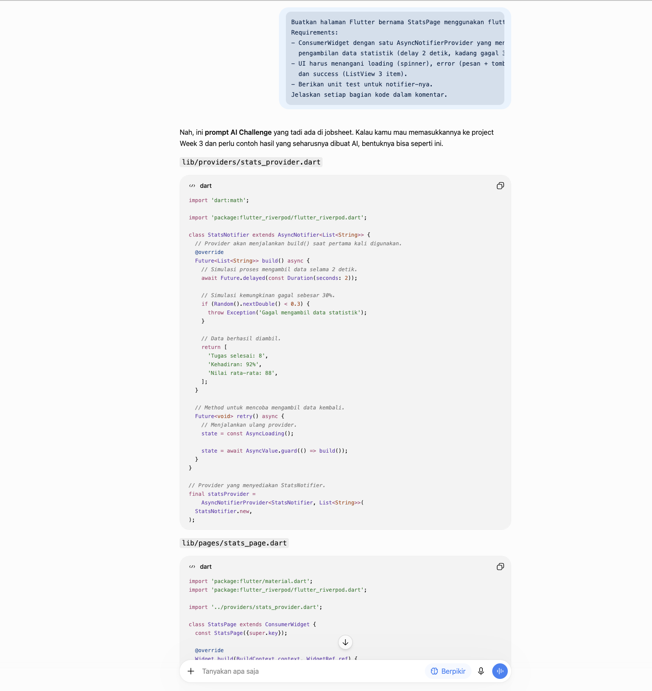
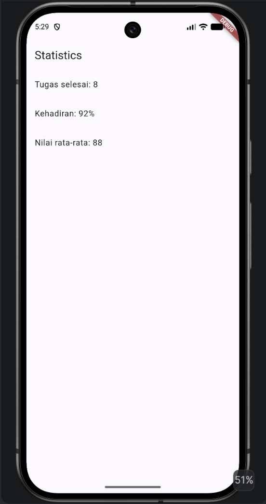
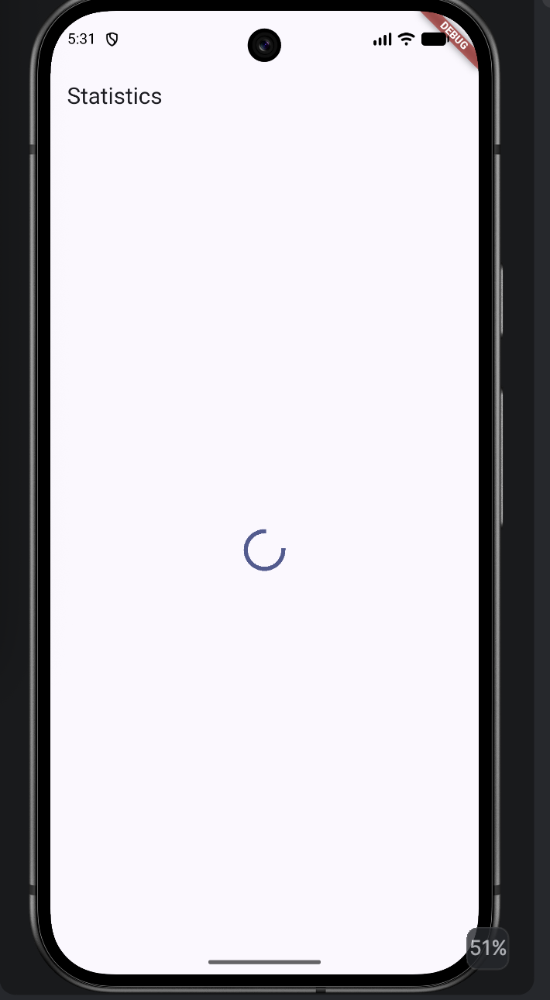
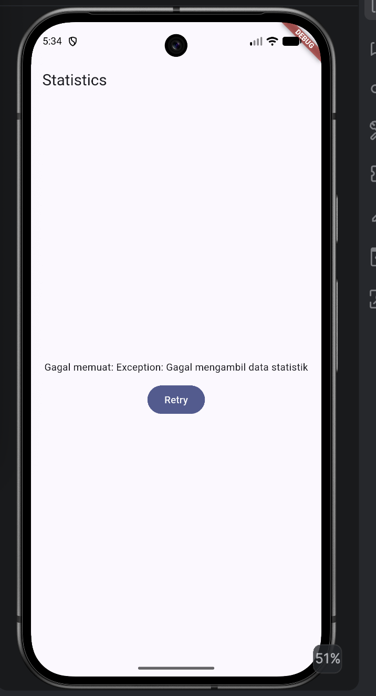

# AI Challenge

## Peran AI pada Codelab

AI digunakan sebagai co-developer untuk membantu membuat boilerplate dan membandingkan solusi teknis.

Hasil dari AI tidak langsung digunakan. Kode tetap dibaca, dipahami, diperiksa, dijalankan, dan diuji sebelum diterapkan ke project.

---
## AI Prompt Challenge

### Prompt

```text
Buatkan halaman Flutter bernama StatsPage menggunakan flutter_riverpod.
Requirements:
- ConsumerWidget dengan satu AsyncNotifierProvider yang mensimulasikan
  pengambilan data statistik (delay 2 detik, kadang gagal 30%).
- UI harus menangani loading (spinner), error (pesan + tombol retry),
  dan success (ListView 3 item).
- Berikan unit test untuk notifier-nya.
Jelaskan setiap bagian kode dalam komentar.
```

---

# AI Verification Checklist

Hasil verifikasi terhadap output AI:

- [x] State menggunakan pola immutable.
- [x] Tidak terdapat `state.add()` atau mutasi list secara langsung.
- [x] `ref.watch` digunakan di `build`.
- [x] `ref.read` digunakan pada callback.
- [x] Loading, error, dan success ditangani.
- [x] Provider mempunyai tipe yang jelas.
- [x] Tidak terdapat provider yang duplikat.
- [x] Pola Riverpod menggunakan `Notifier` dan `ConsumerWidget`.
- [x] Kode dijalankan menggunakan Flutter.
- [x] `flutter analyze` dan `flutter test` digunakan untuk verifikasi.






---