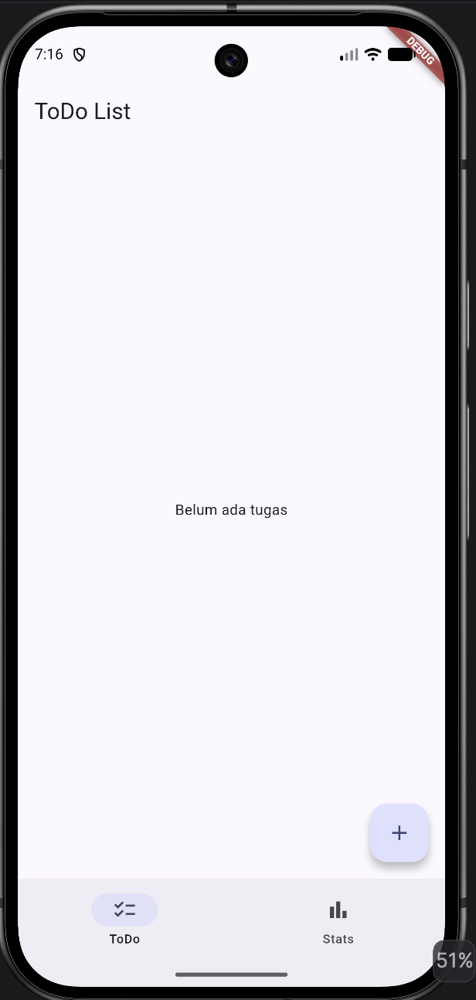
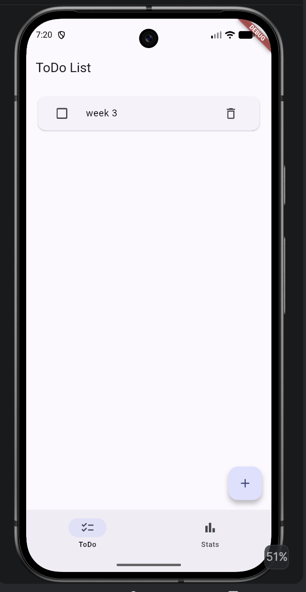
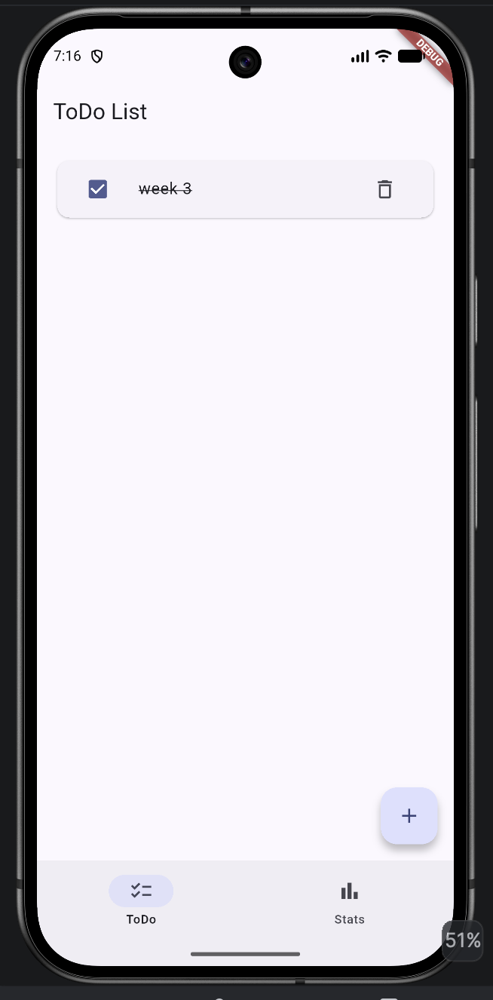
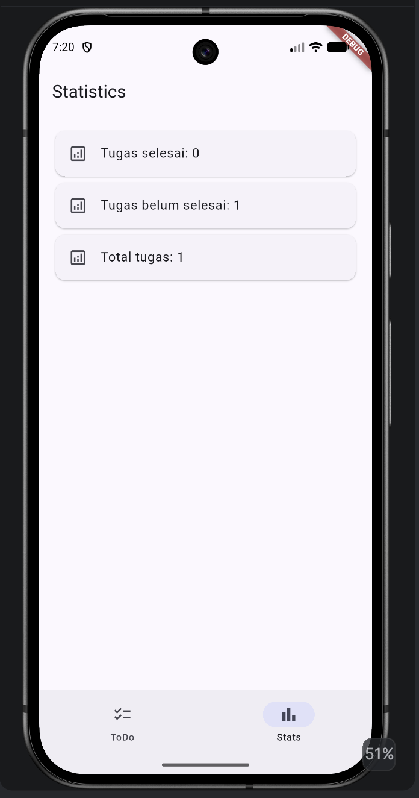
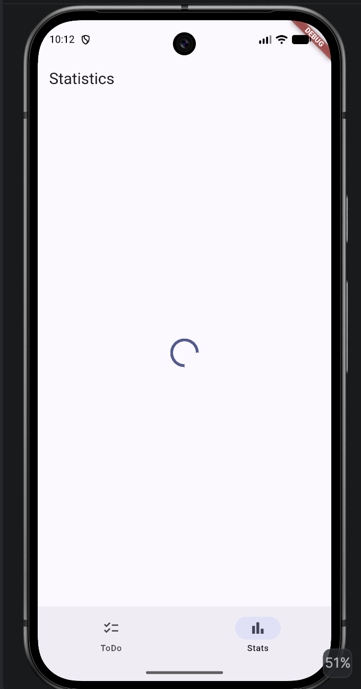
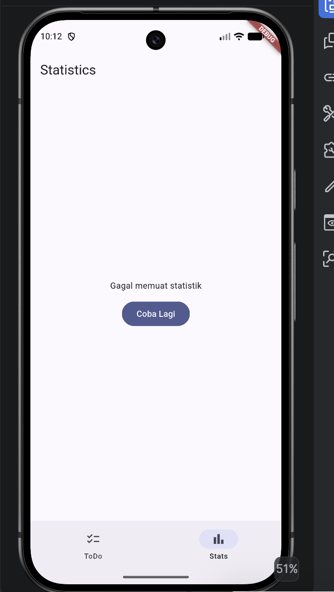

# Mini Project Week 3 — ToDo App

## 📌 Selamat Datang

Mini Project Week 3 merupakan implementasi materi **Navigation dan State Management pada Flutter**.

Pada project ini dibuat sebuah aplikasi sederhana **ToDo List** yang memiliki dua halaman utama, yaitu halaman ToDo List dan halaman Statistics. Aplikasi menggunakan `go_router` untuk mengatur navigasi dan `flutter_riverpod` untuk mengelola state aplikasi.

Project ini menerapkan beberapa konsep yang dipelajari pada Week 3, yaitu `Notifier`, `AsyncNotifier`, `NotifierProvider`, `AsyncNotifierProvider`, `ConsumerWidget`, `ShellRoute`, `NavigationBar`, serta unit testing.

---

# 👩🏻‍💻 Informasi Mahasiswa

| Informasi     | Detail                   |
| ------------- | ------------------------ |
| Nama          | Vanesa Mardiana Putri    |
| NIM           | 244107020129             |
| Kelas         | TI-3G                    |
| Program Studi | D4 Teknik Informatika    |
| Institusi     | Politeknik Negeri Malang |
| Mata Kuliah   | Pemrograman Mobile       |
| Week          | Week 3                   |
| Project       | Mini Project ToDo App    |

---

# 📖 Deskripsi Project

Mini Project ini berupa aplikasi **ToDo List** sederhana yang digunakan untuk menerapkan konsep navigation dan state management pada Flutter.

Aplikasi memiliki dua halaman utama, yaitu halaman **ToDo List** dan halaman **Statistics**. Halaman ToDo digunakan untuk mengelola daftar tugas, sedangkan halaman Statistics digunakan untuk menampilkan jumlah tugas berdasarkan statusnya.

Pengelolaan state dilakukan menggunakan **Riverpod**, sedangkan navigasi antar halaman dilakukan menggunakan **GoRouter**.

Fitur yang tersedia pada aplikasi:

* Menampilkan daftar tugas.
* Menambahkan tugas baru.
* Menandai tugas sebagai selesai.
* Menghapus tugas.
* Melihat statistik tugas.
* Menampilkan loading saat mengambil data statistik.
* Menangani kondisi error.
* Melakukan retry ketika terjadi error.
* Berpindah halaman menggunakan NavigationBar.
* Melakukan unit testing pada TodoNotifier.

---

# 🎯 Tujuan

Tujuan dari pembuatan Mini Project ini adalah:

1. Memahami konsep state management pada Flutter.
2. Memahami penggunaan Riverpod.
3. Memahami penggunaan `Notifier` untuk state synchronous.
4. Memahami penggunaan `AsyncNotifier` untuk state asynchronous.
5. Memahami penggunaan `NotifierProvider`.
6. Memahami penggunaan `AsyncNotifierProvider`.
7. Memahami penggunaan `ConsumerWidget`.
8. Memahami penggunaan `go_router`.
9. Memahami penggunaan `ShellRoute`.
10. Memahami penggunaan `NavigationBar`.
11. Memahami penggunaan `AsyncValue`.
12. Memahami cara membuat loading dan error state.
13. Menerapkan unit testing pada provider.
14. Menggabungkan navigation dan state management dalam satu aplikasi.

---

# 🛠️ Teknologi yang Digunakan

| Teknologi        | Keterangan                       |
| ---------------- | -------------------------------- |
| Flutter          | Framework untuk membuat aplikasi |
| Dart             | Bahasa pemrograman Flutter       |
| Riverpod         | State management                 |
| GoRouter         | Navigation dan routing           |
| Flutter Test     | Testing                          |
| Android Emulator | Pengujian aplikasi               |

---

# 📦 Package yang Digunakan

Package yang digunakan pada project:

* `flutter_riverpod`
* `go_router`
* `flutter_test`

Versi package utama:

```yaml
dependencies:
  flutter:
    sdk: flutter
  flutter_riverpod: ^3.4.3
  go_router: ^18.0.1
```

## flutter_riverpod

`flutter_riverpod` digunakan untuk mengelola state aplikasi.

Pada project ini Riverpod digunakan untuk mengelola:

* daftar ToDo
* status tugas
* statistik tugas
* state asynchronous

Beberapa class dan widget Riverpod yang digunakan:

* `ProviderScope`
* `Notifier`
* `NotifierProvider`
* `AsyncNotifier`
* `AsyncNotifierProvider`
* `ConsumerWidget`
* `WidgetRef`
* `AsyncValue`

## go_router

`go_router` digunakan untuk mengatur navigasi antar halaman.

Pada project ini digunakan:

* `GoRouter`
* `GoRoute`
* `ShellRoute`
* `context.go()`

---

# 📂 Struktur Project

```text
03-week-3-navigation-state-management/
│
├── README.md
│
├── screenshots/
│   ├── 01_todo_list.png
│   ├── 02_todo_added.png
│   ├── 03_statistics.png
│   ├── 04_loading.png
│   ├── 05_error.png
│   └── 06_success.png
│
└── mini-project/
    │
    ├── android/
    ├── ios/
    │
    ├── lib/
    │   ├── pages/
    │   │   ├── main_page.dart
    │   │   ├── todo_page.dart
    │   │   └── stats_page.dart
    │   │
    │   ├── providers/
    │   │   ├── todo_provider.dart
    │   │   └── stats_provider.dart
    │   │
    │   └── main.dart
    │
    ├── test/
    │   └── todo_provider_test.dart
    │
    ├── pubspec.yaml
    └── README.md
```

Screenshot yang digunakan pada README ini berada di folder `screenshots` milik Week 3.

Karena `README.md` Mini Project berada satu folder di bawah folder `screenshots`, maka path gambar menggunakan:

```text
../screenshots/nama_file.png
```

---

# 🚀 Persiapan Project

Project Flutter dibuat menggunakan perintah:

```bash
flutter create .
```

Kemudian package Riverpod dan GoRouter ditambahkan:

```bash
flutter pub add flutter_riverpod go_router
```

Folder yang digunakan untuk halaman dan provider:

```bash
mkdir -p lib/pages lib/providers lib/widgets
```

Setelah semua package berhasil dipasang, project dapat dijalankan menggunakan Android Emulator.

---

# 1. Main Application

File:

```text
lib/main.dart
```

`main.dart` merupakan entry point dari aplikasi.

Kode:

```dart
import 'package:flutter/material.dart';
import 'package:flutter_riverpod/flutter_riverpod.dart';
import 'package:go_router/go_router.dart';

import 'pages/main_page.dart';
import 'pages/todo_page.dart';
import 'pages/stats_page.dart';

void main() {
  runApp(
    const ProviderScope(
      child: MyApp(),
    ),
  );
}

final router = GoRouter(
  routes: [
    ShellRoute(
      builder: (context, state, child) {
        return MainPage(child: child);
      },
      routes: [
        GoRoute(
          path: '/',
          builder: (context, state) => const TodoPage(),
        ),
        GoRoute(
          path: '/stats',
          builder: (context, state) => const StatsPage(),
        ),
      ],
    ),
  ],
);

class MyApp extends StatelessWidget {
  const MyApp({super.key});

  @override
  Widget build(BuildContext context) {
    return MaterialApp.router(
      title: 'ToDo App',
      routerConfig: router,
      theme: ThemeData(
        colorSchemeSeed: Colors.indigo,
        useMaterial3: true,
      ),
    );
  }
}
```

---

# 2. ProviderScope

Pada bagian `main()` terdapat:

```dart
ProviderScope(
  child: MyApp(),
)
```

`ProviderScope` digunakan untuk menyediakan tempat bagi Riverpod dalam mengelola provider.

Dengan adanya `ProviderScope`, widget yang berada di dalam aplikasi dapat menggunakan provider yang telah dibuat.

Pada project ini `ProviderScope` menjadi bagian awal dari penggunaan Riverpod.

---

# 3. Navigation dengan GoRouter

Navigation pada aplikasi menggunakan `GoRouter`.

Terdapat dua route utama:

| Path     | Halaman   |
| -------- | --------- |
| `/`      | TodoPage  |
| `/stats` | StatsPage |

Route untuk halaman ToDo:

```dart
GoRoute(
  path: '/',
  builder: (context, state) => const TodoPage(),
),
```

Route untuk halaman Statistics:

```dart
GoRoute(
  path: '/stats',
  builder: (context, state) => const StatsPage(),
),
```

Ketika path `/` dibuka, aplikasi akan menampilkan `TodoPage`.

Ketika path `/stats` dibuka, aplikasi akan menampilkan `StatsPage`.

---

# 4. ShellRoute

Aplikasi menggunakan `ShellRoute`:

```dart
ShellRoute(
  builder: (context, state, child) {
    return MainPage(child: child);
  },
  routes: [
    ...
  ],
)
```

`ShellRoute` digunakan untuk membuat layout utama yang membungkus halaman-halaman di dalamnya.

Pada project ini `MainPage` digunakan sebagai layout utama yang berisi `NavigationBar`.

Dengan menggunakan `ShellRoute`, NavigationBar tetap tersedia ketika user berpindah antara halaman ToDo dan Statistics.

---

# 5. MainPage

File:

```text
lib/pages/main_page.dart
```

`MainPage` digunakan sebagai layout utama aplikasi.

Kode:

```dart
import 'package:flutter/material.dart';
import 'package:go_router/go_router.dart';

class MainPage extends StatelessWidget {
  const MainPage({
    super.key,
    required this.child,
  });

  final Widget child;

  @override
  Widget build(BuildContext context) {
    final location = GoRouterState.of(context).uri.path;

    int currentIndex = 0;

    if (location == '/stats') {
      currentIndex = 1;
    }

    return Scaffold(
      body: child,
      bottomNavigationBar: NavigationBar(
        selectedIndex: currentIndex,
        onDestinationSelected: (index) {
          if (index == 0) {
            context.go('/');
          } else {
            context.go('/stats');
          }
        },
        destinations: const [
          NavigationDestination(
            icon: Icon(Icons.checklist),
            label: 'ToDo',
          ),
          NavigationDestination(
            icon: Icon(Icons.bar_chart),
            label: 'Stats',
          ),
        ],
      ),
    );
  }
}
```

`MainPage` menerima `child` dari `ShellRoute`.

`child` merupakan halaman yang sedang ditampilkan.

---

# 6. NavigationBar

Pada bagian bawah aplikasi terdapat `NavigationBar`.

NavigationBar memiliki dua menu:

1. ToDo
2. Stats

Ketika menu ToDo dipilih:

```dart
context.go('/');
```

Ketika menu Stats dipilih:

```dart
context.go('/stats');
```

Index menu ditentukan berdasarkan path yang sedang aktif.

Jika path:

```text
/stats
```

maka:

```dart
currentIndex = 1;
```

Jika bukan `/stats`, maka:

```dart
currentIndex = 0;
```

---

# 📸 Hasil Navigation

## Halaman ToDo





## Halaman Statistics



---

# 7. Todo Model

File:

```text
lib/providers/todo_provider.dart
```

Model `Todo` digunakan untuk menyimpan informasi dari sebuah tugas.

Kode:

```dart
class Todo {
  final String title;
  final bool isDone;

  Todo({
    required this.title,
    this.isDone = false,
  });
}
```

Model memiliki dua property:

| Property | Tipe   | Keterangan   |
| -------- | ------ | ------------ |
| `title`  | String | Nama tugas   |
| `isDone` | bool   | Status tugas |

Property `isDone` memiliki nilai default `false`.

Artinya, setiap tugas yang baru dibuat memiliki status belum selesai.

---

# 8. TodoNotifier

`TodoNotifier` digunakan untuk mengelola daftar tugas.

Kode:

```dart
class TodoNotifier extends Notifier<List<Todo>> {
  @override
  List<Todo> build() {
    return [];
  }

  void addTodo(String title) {
    state = [
      ...state,
      Todo(title: title),
    ];
  }

  void toggleTodo(int index) {
    final todos = [...state];

    todos[index] = Todo(
      title: todos[index].title,
      isDone: !todos[index].isDone,
    );

    state = todos;
  }

  void deleteTodo(int index) {
    final todos = [...state];
    todos.removeAt(index);

    state = todos;
  }
}
```

`TodoNotifier` menggunakan:

```dart
Notifier<List<Todo>>
```

Artinya state yang dikelola oleh notifier berupa:

```dart
List<Todo>
```

---

# 9. Build TodoNotifier

Pada method `build()`:

```dart
@override
List<Todo> build() {
  return [];
}
```

Nilai awal state adalah list kosong.

Jadi ketika aplikasi pertama kali dibuka, belum ada tugas yang ditampilkan.

---

# 10. TodoProvider

Provider dibuat menggunakan:

```dart
final todoProvider =
    NotifierProvider<TodoNotifier, List<Todo>>(TodoNotifier.new);
```

Provider ini menghubungkan `TodoNotifier` dengan state `List<Todo>`.

Provider dapat digunakan oleh widget untuk membaca state maupun menjalankan method pada notifier.

---

# 11. Menambahkan ToDo

Method untuk menambahkan tugas:

```dart
void addTodo(String title) {
  state = [
    ...state,
    Todo(title: title),
  ];
}
```

`...state` digunakan untuk mempertahankan tugas yang sudah ada.

Kemudian tugas baru ditambahkan ke dalam list.

Contoh:

```text
Sebelum:
[]

Tambah:
Belajar Flutter

Sesudah:
[Belajar Flutter]
```

---

# 12. Mengubah Status ToDo

Method untuk mengubah status tugas:

```dart
void toggleTodo(int index) {
  final todos = [...state];

  todos[index] = Todo(
    title: todos[index].title,
    isDone: !todos[index].isDone,
  );

  state = todos;
}
```

Jika tugas memiliki:

```text
isDone = false
```

maka setelah checkbox ditekan akan berubah menjadi:

```text
isDone = true
```

Jika ditekan kembali, status akan kembali menjadi:

```text
isDone = false
```

---

# 13. Menghapus ToDo

Method untuk menghapus tugas:

```dart
void deleteTodo(int index) {
  final todos = [...state];
  todos.removeAt(index);

  state = todos;
}
```

Method tersebut membuat salinan state terlebih dahulu.

Kemudian data pada index yang dipilih dihapus menggunakan:

```dart
removeAt(index)
```

Setelah itu state diperbarui.

---

# 14. TodoPage

File:

```text
lib/pages/todo_page.dart
```

`TodoPage` menggunakan `ConsumerWidget`.

Kode:

```dart
class TodoPage extends ConsumerWidget {
  const TodoPage({super.key});

  @override
  Widget build(BuildContext context, WidgetRef ref) {
    final todos = ref.watch(todoProvider);

    ...
  }
}
```

`ConsumerWidget` digunakan karena halaman membutuhkan akses ke provider Riverpod.

---

# 15. Membaca TodoProvider

State dibaca menggunakan:

```dart
final todos = ref.watch(todoProvider);
```

`ref.watch()` digunakan untuk memperhatikan perubahan pada provider.

Jika state berubah, widget akan melakukan rebuild sehingga tampilan ikut berubah.

---

# 16. Menampilkan Daftar ToDo

Jika belum ada tugas, aplikasi menampilkan:

```dart
const Center(
  child: Text('Belum ada tugas'),
)
```

Jika terdapat tugas, aplikasi menggunakan `ListView.builder`.

```dart
ListView.builder(
  padding: const EdgeInsets.all(16),
  itemCount: todos.length,
  itemBuilder: (context, index) {
    final todo = todos[index];

    return Card(
      child: ListTile(
        ...
      ),
    );
  },
)
```

Setiap tugas ditampilkan menggunakan `Card` dan `ListTile`.

---

# 17. Checkbox ToDo

Checkbox digunakan untuk mengubah status tugas.

Kode:

```dart
Checkbox(
  value: todo.isDone,
  onChanged: (_) {
    ref.read(todoProvider.notifier).toggleTodo(index);
  },
)
```

Ketika checkbox ditekan, method:

```dart
toggleTodo(index)
```

akan dijalankan.

---

# 18. Tampilan Tugas Selesai

Jika `isDone` bernilai `true`, judul tugas akan diberi efek coret.

Kode:

```dart
style: TextStyle(
  decoration:
      todo.isDone ? TextDecoration.lineThrough : null,
),
```

Hal ini membuat tugas yang sudah selesai dapat dibedakan dari tugas yang belum selesai.

---

# 19. Tombol Delete

Tombol delete digunakan untuk menghapus tugas.

Kode:

```dart
IconButton(
  icon: const Icon(Icons.delete_outline),
  onPressed: () {
    ref.read(todoProvider.notifier).deleteTodo(index);
  },
)
```

Ketika tombol ditekan, tugas pada index tersebut akan dihapus dari state.

---

# 20. FloatingActionButton

FloatingActionButton digunakan untuk menambahkan tugas.

Kode:

```dart
FloatingActionButton(
  onPressed: () {
    _showAddTodoDialog(context, ref);
  },
  child: const Icon(Icons.add),
)
```

Ketika tombol ditekan, aplikasi akan menampilkan dialog untuk memasukkan tugas baru.

---

# 21. Dialog Tambah Tugas

Dialog dibuat menggunakan `showDialog()`.

Di dalam dialog terdapat `TextField` untuk memasukkan tugas.

Ketika tombol `Tambah` ditekan, input akan diperiksa terlebih dahulu.

Jika input tidak kosong, maka:

```dart
ref
    .read(todoProvider.notifier)
    .addTodo(controller.text.trim());
```

akan dijalankan.

---

# 📸 Hasil Menambahkan ToDo


---

# 22. StatsPage

File:

```text
lib/pages/stats_page.dart
```

`StatsPage` digunakan untuk menampilkan statistik dari daftar tugas.

Halaman menggunakan `ConsumerWidget`.

Kode:

```dart
class StatsPage extends ConsumerWidget {
  const StatsPage({super.key});

  @override
  Widget build(BuildContext context, WidgetRef ref) {
    final stats = ref.watch(statsProvider);

    ...
  }
}
```

---

# 23. StatsNotifier

File:

```text
lib/providers/stats_provider.dart
```

`StatsNotifier` digunakan untuk mengelola data statistik secara asynchronous.

Kode:

```dart
class StatsNotifier extends AsyncNotifier<List<String>> {
  @override
  Future<List<String>> build() async {
    ref.watch(todoProvider);

    await Future.delayed(const Duration(seconds: 1));

    final todos = ref.read(todoProvider);

    final total = todos.length;
    final selesai = todos.where((todo) => todo.isDone).length;
    final belumSelesai = total - selesai;

    return [
      'Tugas selesai: $selesai',
      'Tugas belum selesai: $belumSelesai',
      'Total tugas: $total',
    ];
  }

  Future<void> retry() async {
    state = const AsyncLoading();

    state = await AsyncValue.guard(() async {
      await Future.delayed(const Duration(seconds: 1));

      final todos = ref.read(todoProvider);

      final total = todos.length;
      final selesai = todos.where((todo) => todo.isDone).length;
      final belumSelesai = total - selesai;

      return [
        'Tugas selesai: $selesai',
        'Tugas belum selesai: $belumSelesai',
        'Total tugas: $total',
      ];
    });
  }
}
```

---

# 24. AsyncNotifier

`StatsNotifier` menggunakan:

```dart
AsyncNotifier<List<String>>
```

`AsyncNotifier` digunakan karena proses pengambilan statistik dibuat asynchronous.

Data yang dihasilkan berupa:

```dart
Future<List<String>>
```

Berbeda dengan `TodoNotifier` yang menggunakan state synchronous.

---

# 25. Simulasi Proses Asynchronous

Pada method `build()` terdapat:

```dart
await Future.delayed(const Duration(seconds: 1));
```

Delay satu detik digunakan untuk mensimulasikan proses pengambilan data.

Selama proses tersebut berlangsung, `StatsPage` dapat berada pada kondisi loading.

---

# 26. Mengambil Data ToDo

Data ToDo dibaca menggunakan:

```dart
final todos = ref.read(todoProvider);
```

Kemudian data digunakan untuk menghitung statistik.

---

# 27. Menghitung Total Tugas

Jumlah seluruh tugas dihitung menggunakan:

```dart
final total = todos.length;
```

Contohnya jika terdapat tiga tugas:

```text
Total tugas = 3
```

---

# 28. Menghitung Tugas Selesai

Jumlah tugas yang sudah selesai dihitung menggunakan:

```dart
final selesai = todos.where((todo) => todo.isDone).length;
```

Method tersebut mencari tugas yang memiliki:

```text
isDone = true
```

Kemudian jumlahnya dihitung.

---

# 29. Menghitung Tugas Belum Selesai

Jumlah tugas yang belum selesai dihitung menggunakan:

```dart
final belumSelesai = total - selesai;
```

Contohnya:

```text
Total tugas       = 3
Tugas selesai     = 1
Tugas belum selesai = 2
```

---

# 30. Hasil Statistik

Data statistik dikembalikan dalam bentuk list:

```dart
return [
  'Tugas selesai: $selesai',
  'Tugas belum selesai: $belumSelesai',
  'Total tugas: $total',
];
```

Karena data berupa `List<String>`, data dapat ditampilkan menggunakan `ListView.builder`.

---

# 31. StatsProvider

Provider dibuat menggunakan:

```dart
final statsProvider =
    AsyncNotifierProvider<StatsNotifier, List<String>>(StatsNotifier.new);
```

Provider tersebut menghubungkan `StatsNotifier` dengan state asynchronous berupa:

```dart
List<String>
```

---

# 32. AsyncValue

Pada `StatsPage`, state dari `statsProvider` ditangani menggunakan:

```dart
stats.when(
  loading: () {
    ...
  },
  error: (error, stackTrace) {
    ...
  },
  data: (data) {
    ...
  },
)
```

Terdapat tiga kondisi utama:

| Kondisi | Tampilan                   |
| ------- | --------------------------- |
| Loading | CircularProgressIndicator  |
| Error   | Pesan error + tombol retry |
| Data    | List statistik             |

---

# 33. Loading State

Ketika statistik sedang diproses, aplikasi menampilkan:

```dart
loading: () {
  return const Center(
    child: CircularProgressIndicator(),
  );
},
```

`CircularProgressIndicator` digunakan untuk menunjukkan bahwa proses masih berlangsung.

---

# 📸 Hasil Loading



---

# 34. Success State

Jika data berhasil diperoleh, aplikasi menampilkan statistik menggunakan `ListView.builder`.

Kode:

```dart
data: (data) {
  return ListView.builder(
    padding: const EdgeInsets.all(16),
    itemCount: data.length,
    itemBuilder: (context, index) {
      return Card(
        child: ListTile(
          leading: const Icon(Icons.analytics_outlined),
          title: Text(data[index]),
        ),
      );
    },
  );
},
```

Data statistik akan ditampilkan sebagai tiga item.

Contoh:

```text
Tugas selesai: 1
Tugas belum selesai: 2
Total tugas: 3
```

---

# 📸 Hasil Success


---

# 35. Error State

Aplikasi juga memiliki tampilan untuk menangani kondisi error.

Kode:

```dart
error: (error, stackTrace) {
  return Center(
    child: Column(
      mainAxisAlignment: MainAxisAlignment.center,
      children: [
        const Text('Gagal memuat statistik'),
        const SizedBox(height: 12),
        FilledButton(
          onPressed: () {
            ref.read(statsProvider.notifier).retry();
          },
          child: const Text('Coba Lagi'),
        ),
      ],
    ),
  );
},
```

Jika terjadi error, aplikasi menampilkan pesan:

```text
Gagal memuat statistik
```

dan tombol:

```text
Coba Lagi
```

---

# 📸 Hasil Error



---

# 36. Retry

Tombol `Coba Lagi` menjalankan method:

```dart
retry()
```

Method tersebut mengubah state menjadi loading:

```dart
state = const AsyncLoading();
```

Kemudian proses statistik dijalankan kembali.

Pada proses retry digunakan:

```dart
AsyncValue.guard()
```

`AsyncValue.guard()` digunakan untuk menjalankan proses asynchronous sekaligus menangani kemungkinan error.

---

# 37. State Management Flow

Alur state management aplikasi:

```text
User
 │
 ├── Tambah ToDo
 │       ↓
 │   TodoNotifier
 │       ↓
 │   todoProvider
 │       ↓
 │   TodoPage
 │
 ├── Checklist ToDo
 │       ↓
 │   TodoNotifier
 │       ↓
 │   todoProvider
 │       ↓
 │   TodoPage
 │
 ├── Hapus ToDo
 │       ↓
 │   TodoNotifier
 │       ↓
 │   todoProvider
 │
 └── Buka Statistics
         ↓
    StatsNotifier
         ↓
    statsProvider
         ↓
    StatsPage
```

---

# 38. Navigation Flow

Alur navigation aplikasi:

```text
                  ToDo App
                     │
              ┌──────┴──────┐
              │             │
             ToDo          Stats
              │             │
              ↓             ↓
          TodoPage      StatsPage
              │             │
              └──────┬──────┘
                     │
              NavigationBar
```

Navigation dilakukan menggunakan:

```dart
context.go('/');
```

untuk halaman ToDo dan:

```dart
context.go('/stats');
```

untuk halaman Statistics.

---

# 39. Notifier vs AsyncNotifier

| Notifier                             | AsyncNotifier                      |
| ------------------------------------- | ----------------------------------- |
| Digunakan untuk state synchronous    | Digunakan untuk state asynchronous |
| Digunakan pada Todo                  | Digunakan pada Statistics          |
| State berupa `List<Todo>`            | State berupa `List<String>`        |
| Tidak menggunakan Future             | Menggunakan Future                 |
| Cocok untuk perubahan state langsung | Cocok untuk proses asynchronous    |

Pada project:

```text
TodoNotifier
     ↓
List<Todo>
```

digunakan untuk mengelola daftar tugas.

Sedangkan:

```text
StatsNotifier
     ↓
Future<List<String>>
```

digunakan untuk mengelola statistik.

---

# 40. Konsep yang Digunakan

| Konsep             | Implementasi            |
| ------------------ | ------------------------ |
| State Management   | Riverpod                |
| Provider           | `NotifierProvider`      |
| Async Provider     | `AsyncNotifierProvider` |
| Synchronous State  | `Notifier`              |
| Asynchronous State | `AsyncNotifier`         |
| Widget Provider    | `ConsumerWidget`        |
| Provider Scope     | `ProviderScope`         |
| Navigation         | `go_router`             |
| Routing            | `GoRoute`               |
| Layout Navigation  | `ShellRoute`            |
| Bottom Navigation  | `NavigationBar`         |
| Membaca State      | `ref.watch()`           |
| Mengakses Notifier | `ref.read()`            |
| Async State        | `AsyncValue`            |
| Testing            | `flutter_test`          |

---

# 41. Unit Testing

Testing dilakukan pada file:

```text
test/todo_provider_test.dart
```

Unit testing digunakan untuk memastikan fungsi pada `TodoNotifier` berjalan sesuai dengan yang diharapkan.

Test yang dibuat meliputi:

1. Memastikan state awal kosong.
2. Menambahkan sebuah ToDo.
3. Memastikan jumlah ToDo bertambah.
4. Memastikan judul ToDo sesuai.
5. Memastikan status awal ToDo adalah `false`.
6. Mengubah status ToDo menjadi selesai.

Kode testing:

```dart
import 'package:flutter_test/flutter_test.dart';
import 'package:flutter_riverpod/flutter_riverpod.dart';

import 'package:mini_project/providers/todo_provider.dart';

void main() {
  test('Todo bisa ditambahkan dan diselesaikan', () {
    final container = ProviderContainer();
    addTearDown(container.dispose);

    expect(container.read(todoProvider), isEmpty);

    container.read(todoProvider.notifier).addTodo('Belajar Flutter');

    expect(container.read(todoProvider).length, 1);
    expect(
      container.read(todoProvider)[0].title,
      'Belajar Flutter',
    );
    expect(
      container.read(todoProvider)[0].isDone,
      false,
    );

    container.read(todoProvider.notifier).toggleTodo(0);

    expect(
      container.read(todoProvider)[0].isDone,
      true,
    );
  });
}
```

---

# 42. Hasil Testing

Testing dijalankan menggunakan perintah:

```bash
flutter test
```

Hasil testing menunjukkan bahwa unit test berhasil dijalankan.

Test memastikan bahwa:

```text
State awal        → kosong
Tambah ToDo       → berhasil
Judul ToDo        → sesuai
Status awal       → belum selesai
Toggle ToDo       → menjadi selesai
```

---

# 43. Cara Menjalankan Project

Masuk ke folder Mini Project:

```bash
cd mini-project
```

Ambil dependency:

```bash
flutter pub get
```

Periksa device yang tersedia:

```bash
flutter devices
```

Jalankan aplikasi:

```bash
flutter run
```

Project dijalankan menggunakan **Android Emulator**.

---

# 44. Pengujian Aplikasi

Pengujian dilakukan pada Android Emulator.

Hal yang diuji:

* Aplikasi dapat dibuka.
* Halaman ToDo dapat ditampilkan.
* ToDo dapat ditambahkan.
* Checkbox dapat digunakan.
* ToDo dapat dihapus.
* NavigationBar dapat digunakan.
* Halaman Statistics dapat dibuka.
* Loading dapat ditampilkan.
* Data statistik dapat ditampilkan.
* Error state tersedia.
* Tombol retry tersedia.

---

# 45. Hasil dan Output

Hasil akhir Mini Project berupa aplikasi ToDo sederhana yang memiliki dua halaman utama.

## ToDo List

Halaman ToDo digunakan untuk mengelola daftar tugas.

User dapat:

* melihat tugas
* menambahkan tugas
* mencentang tugas
* menghapus tugas

## Statistics

Halaman Statistics digunakan untuk menampilkan:

* jumlah tugas selesai
* jumlah tugas belum selesai
* jumlah seluruh tugas

## Navigation

NavigationBar digunakan untuk berpindah antara halaman ToDo dan Statistics.

## State Management

State ToDo dikelola menggunakan `TodoNotifier`, sedangkan statistik dikelola menggunakan `StatsNotifier`.

---

# 46. Screenshot Hasil Project

## 1. Todo List


## 2. Todo Setelah Ditambahkan


## 3. Statistics


## 4. Loading


## 5. Error


## 6. Success


---

# 47. Refleksi

Melalui Mini Project ini, saya memahami bahwa state management digunakan untuk mengatur perubahan data yang terjadi pada aplikasi.

Pada aplikasi ToDo, `Notifier` digunakan untuk mengelola state yang bersifat synchronous. State tersebut digunakan untuk menambahkan, mengubah, dan menghapus data tugas.

Saya juga memahami penggunaan `AsyncNotifier` untuk mengelola proses asynchronous pada halaman Statistics. Dengan `AsyncNotifier`, aplikasi dapat menangani kondisi loading, error, dan data.

Selain state management, saya memahami penggunaan `go_router` untuk mengatur navigation antar halaman. Penggunaan `ShellRoute` juga membantu membuat layout utama yang dapat digunakan bersama oleh beberapa halaman.

Unit testing juga membantu memastikan fungsi utama pada `TodoNotifier` berjalan sesuai dengan kebutuhan.

---

# 48. Kesimpulan

Mini Project Week 3 berhasil mengimplementasikan konsep **Navigation dan State Management pada Flutter**.

Aplikasi menggunakan `go_router` untuk mengatur navigasi antara halaman ToDo dan Statistics. `ShellRoute` digunakan untuk mempertahankan layout utama dan NavigationBar pada kedua halaman.

State management menggunakan `flutter_riverpod`. `Notifier` digunakan untuk mengelola daftar tugas, sedangkan `AsyncNotifier` digunakan untuk mengelola data statistik secara asynchronous.

Project juga menerapkan `ProviderScope`, `NotifierProvider`, `AsyncNotifierProvider`, `ConsumerWidget`, `AsyncValue`, loading state, error handling, retry, serta unit testing.

Dengan Mini Project ini, konsep Navigation dan State Management dapat diterapkan secara langsung pada aplikasi Flutter sederhana.

---

# 📋 Checklist Verifikasi

* [x] Project Flutter berhasil dibuat
* [x] `flutter_riverpod` berhasil ditambahkan
* [x] `go_router` berhasil ditambahkan
* [x] `ProviderScope` digunakan
* [x] `Notifier` digunakan
* [x] `NotifierProvider` digunakan
* [x] `AsyncNotifier` digunakan
* [x] `AsyncNotifierProvider` digunakan
* [x] `ConsumerWidget` digunakan
* [x] `WidgetRef` digunakan
* [x] `GoRouter` digunakan
* [x] `GoRoute` digunakan
* [x] `ShellRoute` digunakan
* [x] `NavigationBar` digunakan
* [x] ToDo dapat ditambahkan
* [x] ToDo dapat dicentang
* [x] ToDo dapat dihapus
* [x] Statistics dapat ditampilkan
* [x] Loading state tersedia
* [x] Error state tersedia
* [x] Retry tersedia
* [x] Unit test dibuat
* [x] `flutter test` berhasil
* [x] Project berhasil dijalankan pada Android Emulator

---

# 📸 Dokumentasi Akhir

Seluruh screenshot pada README ini menggunakan folder:

```text
../screenshots/
```

Struktur folder screenshot:

```text
03-week-3-navigation-state-management/
│
├── screenshots/
│   ├── 01_todo_list.png
│   ├── 02_todo_added.png
│   ├── 03_statistics.png
│   ├── 04_loading.png
│   ├── 05_error.png
│   └── 06_success.png
│
└── mini-project/
    └── README.md
```

Dengan struktur tersebut, gambar dapat dipanggil dari `mini-project/README.md` menggunakan:

```markdown


```

---

# 👩🏻‍💻 Author

**Vanesa Mardiana Putri**

D4 Teknik Informatika
Politeknik Negeri Malang

NIM: 244107020129

---

# 📌 Project Status

**Completed — Week 3 Mini Project**

Project berhasil dijalankan menggunakan Android Emulator dan unit test berhasil dijalankan menggunakan:

```bash
flutter test
```