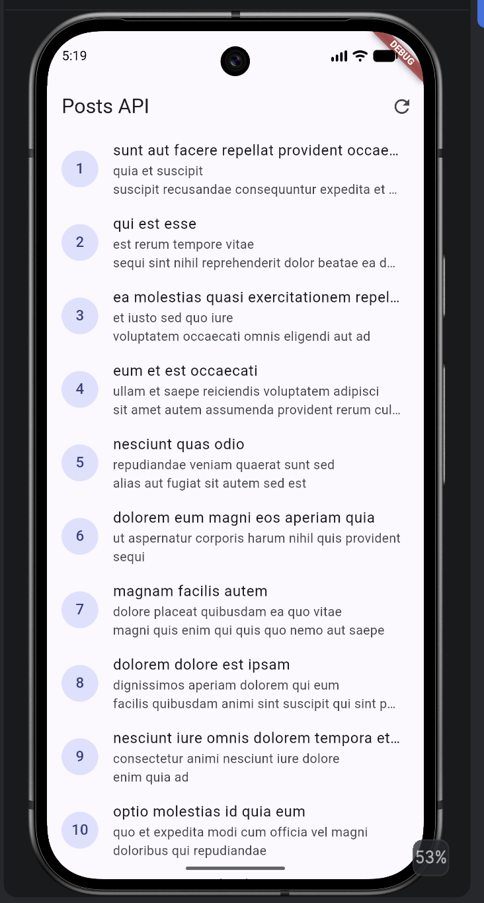
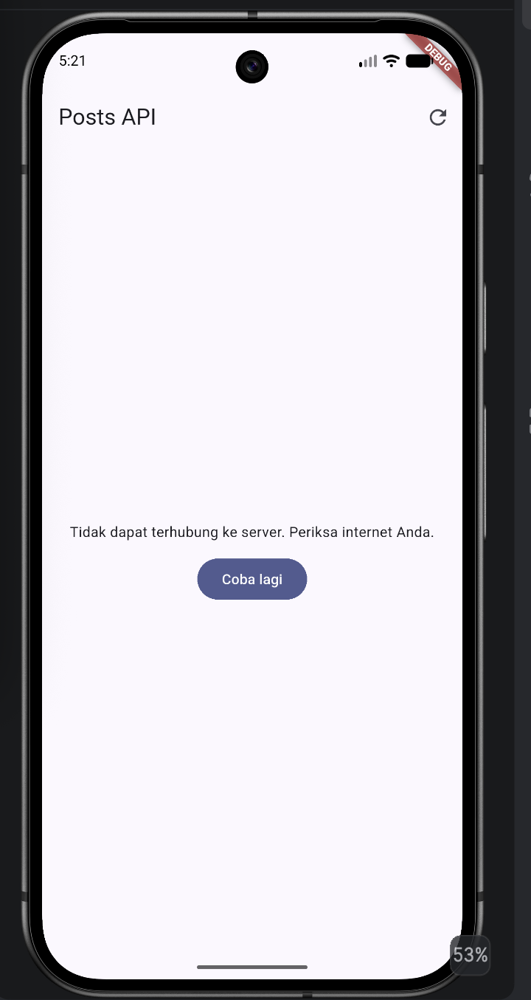
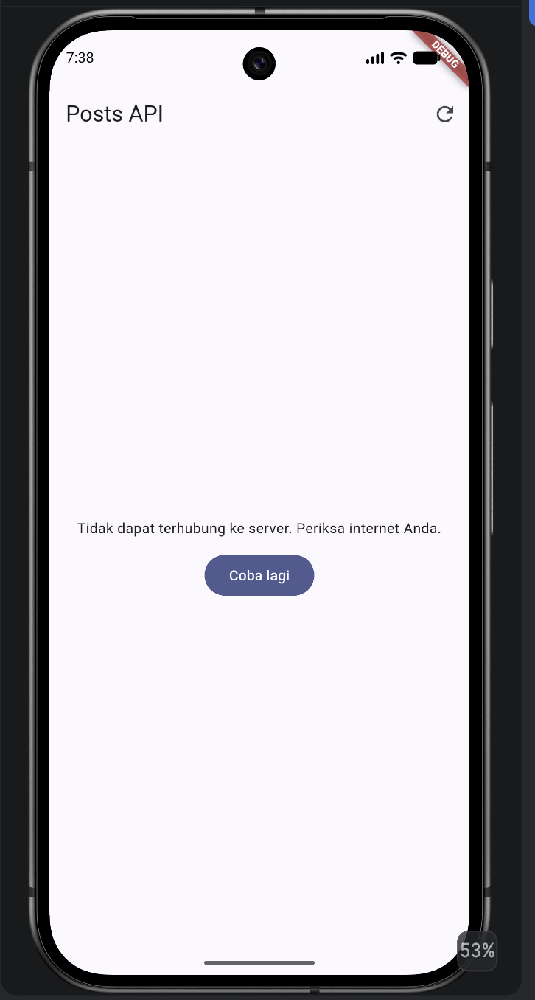
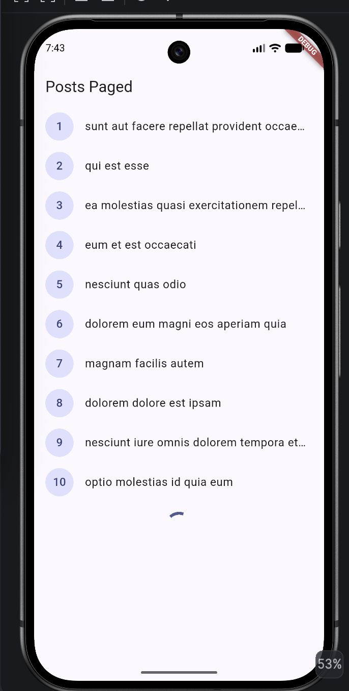
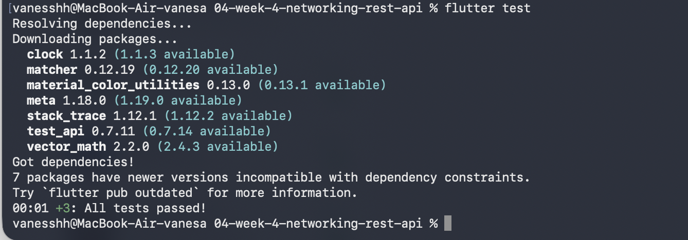

# Week 4 - Networking & REST API

## Identitas

**Nama:** Vanesa Mardiana Putri  
**NIM:** 244107020129  
**Kelas:** TI-3G  
**Mata Kuliah:** Pemrograman Mobile

---

# Praktikum 2 - Networking dengan Dio

Pada praktikum 2 dilakukan implementasi networking menggunakan package Dio untuk mengambil data dari REST API JSONPlaceholder.

API yang digunakan: `https://jsonplaceholder.typicode.com/posts`

Implementasi yang dibuat meliputi:

- Pembuatan `Dio` dengan base URL.
- Pengaturan timeout koneksi.
- Penggunaan interceptor untuk logging request.
- Pembuatan model `Post`.
- Penggunaan `PostRepository` untuk mengambil data dari API.
- Penanganan error jaringan.

### Hasil Praktikum 2



---

# Praktikum 3 - State Management dan Pagination

Pada praktikum 3 digunakan Riverpod untuk mengatur state aplikasi dan menampilkan data dari REST API.

State yang diterapkan meliputi:

- Loading
- Error
- Success
- Empty

Pagination diterapkan dengan mengambil 10 item setiap halaman menggunakan parameter `_page` dan `_limit`. Infinite scroll digunakan agar halaman berikutnya dimuat ketika pengguna mendekati bagian bawah daftar. Guard `isLoadingMore` mencegah request halaman berikutnya dilakukan berulang ketika request sebelumnya masih berjalan.

### Hasil Praktikum 3



---

# Refactoring Challenge

## 1. Ekstraksi `PostTile`

Widget baris post dipindahkan menjadi widget tersendiri di `lib/pages/post_tile.dart`. Dengan begitu kode `ListView.builder` menjadi lebih pendek dan `PostTile` dapat diuji atau digunakan kembali.

## 2. Pemindahan `friendlyErrorMessage`

Fungsi `friendlyErrorMessage` dipindahkan ke `lib/data/network_errors.dart` agar dapat digunakan kembali oleh halaman non-paged maupun paged tanpa menulis fungsi yang sama berulang kali.




---

# Refleksi

## 1. Mengapa UI dilarang memanggil Dio langsung? Apa yang rusak jika aturan ini dilanggar?

UI seharusnya hanya bertugas menampilkan data dan mengatur interaksi pengguna, sedangkan komunikasi dengan API berada di repository. Dengan begitu tampilan, state management, dan networking terpisah dengan jelas.

Jika UI memanggil Dio langsung, kode UI menjadi panjang dan sulit dirawat. Logika networking tersebar di banyak halaman, sehingga perubahan endpoint, timeout, atau cara menangani error harus dilakukan di banyak tempat. Testing juga lebih sulit karena widget berhubungan langsung dengan HTTP. Dengan repository, kita bisa memakai fake repository saat testing tanpa request ke server sungguhan.

## 2. Kapan pagination client-side cukup, dan kapan harus mengandalkan pagination server (`_page`/`_limit`)?

Pagination client-side cukup ketika jumlah data sedikit dan seluruhnya masih wajar diambil sekaligus, lalu ditampilkan bertahap di sisi aplikasi.

Jika data sangat banyak, pagination server lebih tepat karena aplikasi hanya meminta sebagian data yang diperlukan. Pada project ini digunakan pagination server:

```text
_page  = nomor halaman
_limit = jumlah data setiap halaman
```

Setiap request hanya mengambil 10 data, sehingga aplikasi tidak perlu mengambil seluruh data sekaligus.

## 3. Bagaimana exception repository berubah menjadi `AsyncError` tanpa try/catch di setiap widget? Kapan try/catch eksplisit tetap dibutuhkan?

Pada Riverpod, proses asynchronous di `AsyncNotifier` menghasilkan state `AsyncLoading`, `AsyncData`, atau `AsyncError`. Exception yang dilempar repository otomatis ditangkap dan menjadi `AsyncError`, sehingga UI cukup membaca state tanpa `try/catch` di setiap widget:

```text
Loading -> tampilkan loading
Error   -> tampilkan pesan error + tombol retry
Data    -> tampilkan data
```

Try/catch eksplisit tetap dibutuhkan ketika perlu penanganan khusus, misalnya mengubah state secara manual, memberi fallback data, logging tertentu, atau menjalankan proses tambahan saat request gagal.

## 4. Bagian mana dari hasil AI yang Anda perbaiki, dan mengapa?

Hasil dari AI tidak langsung dipakai seluruhnya, beberapa bagian perlu disesuaikan dengan struktur project dan versi package.

Bagian yang diperbaiki adalah provider untuk komentar, karena pola `AsyncNotifierProvider.family` yang diberikan tidak sesuai dengan versi Riverpod yang digunakan. Implementasinya disesuaikan agar `postId` diberikan lewat constructor notifier dan pengambilan data dilakukan melalui repository.

Fungsi `friendlyErrorMessage` yang awalnya ada di `providers.dart` dipindahkan ke `lib/data/network_errors.dart` supaya bisa dipakai ulang oleh halaman paged dan non-paged. Import yang tidak terpakai juga dihapus setelah pengecekan dengan `flutter analyze`.

---

# Pengujian

Project diperiksa menggunakan:

```bash
flutter analyze
flutter test
```


# 04-week-4-networking-rest-api
