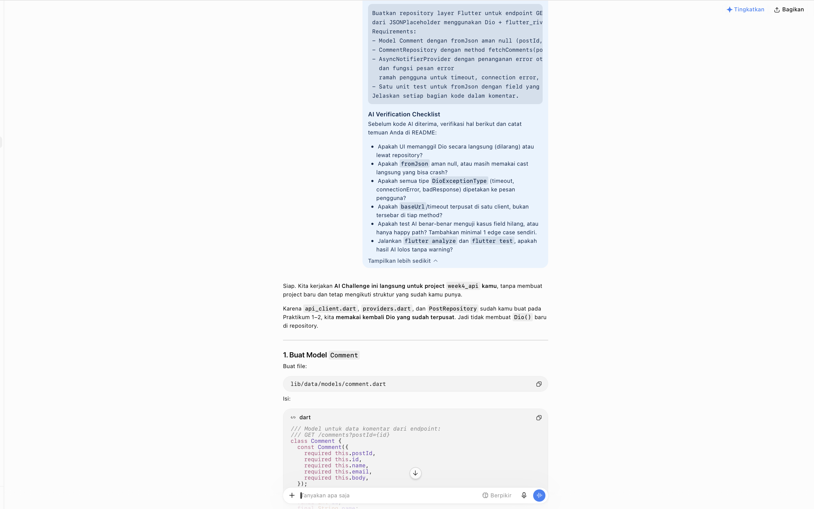
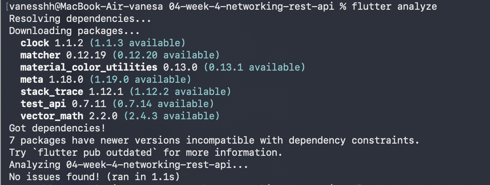

# AI Challenge - Networking & REST API

## Identitas

**Nama:** Vanesa Mardiana Putri  
**NIM:** 244107020129  
**Kelas:** TI-3G  
**Mata Kuliah:** Pemrograman Mobile

---

## Deskripsi

AI Challenge merupakan pengembangan dari aplikasi Networking & REST API pada Week 4. Pada challenge ini ditambahkan fitur untuk mengambil data komentar dari JSONPlaceholder berdasarkan `postId`.

API yang digunakan:

```text
https://jsonplaceholder.typicode.com/posts/{postId}/comments
```

Implementasi menggunakan:

- Dio
- Repository Pattern
- Riverpod
- Model `Comment`
- Unit Testing

---

# Hasil Prompt AI

Fitur komentar dibuat dengan bantuan AI melalui prompt. Berikut hasil prompt yang digunakan:



---

# Implementasi

## 1. Comment Model

Model `Comment` mengubah data JSON dari API menjadi object Dart. Model dibuat dengan null safety agar aman ketika ada field yang hilang atau bernilai `null`.

File: `lib/data/models/comment.dart`

Contoh:

```dart
final comment = Comment.fromJson({'id': 7});
```

Hasil:

```text
id      = 7
postId  = 0
name    = ""
email   = ""
body    = ""
```

## 2. Comment Repository

`CommentRepository` mengambil data komentar dari REST API menggunakan Dio, lalu mengubah response JSON menjadi `List<Comment>`.

Endpoint:

```text
GET /posts/{postId}/comments
```

File: `lib/data/repositories/comment_repository.dart`

## 3. Riverpod Provider

Data komentar dikelola dengan `AsyncNotifier`. Provider menerima `postId` dan mengambil komentar berdasarkan ID post tersebut. Provider juga memiliki fungsi `refresh()` untuk mengambil ulang data.

```text
Berhasil: Loading -> Request API -> Success -> List<Comment>
Gagal   : Loading -> Request API -> Error
```

---

# Testing

## Testing Comment Model

Unit test memastikan `Comment.fromJson()` dapat menangani field yang hilang maupun bernilai `null`.

```dart
test('Comment.fromJson aman terhadap field yang hilang', () {
  final comment = Comment.fromJson({'id': 7});

  expect(comment.id, 7);
  expect(comment.postId, 0);
  expect(comment.name, '');
  expect(comment.email, '');
  expect(comment.body, '');
});
```

## Testing Provider

Provider diuji menggunakan fake repository sehingga pengujian tidak bergantung pada koneksi internet atau API sungguhan.

```dart
class FakeCommentRepository extends CommentRepository {
  FakeCommentRepository(this.comments) : super(Dio());

  final List<Comment> comments;

  @override
  Future<List<Comment>> fetchComments(int postId) async {
    return comments;
  }
}
```

---

# Hasil Flutter Analyze

```bash
flutter analyze
```



---

# Hasil Flutter Test

```bash
flutter test
```


---

# Struktur Dokumentasi

```text
docs/
└── ai-challenge/
    ├── README.md
    └── screenshots/
        ├── hasil-prompt.png
        ├── flutter-analyze.png
        └── flutter-test.png
```

---

# Kesimpulan

AI Challenge menambahkan fitur pengambilan data komentar dari REST API JSONPlaceholder. Implementasi menggunakan Dio sebagai HTTP client, Repository Pattern untuk akses data, Riverpod untuk state management, dan model `Comment` untuk parsing JSON. Pengujian dilakukan pada model dan provider menggunakan unit test dan fake repository.