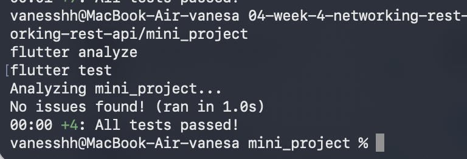

# Mini Project: REST API Posts

Aplikasi Flutter mini project yang menampilkan daftar post dari JSONPlaceholder menggunakan repository pattern dan Riverpod.

## Fitur

- Fetch data dari API publik `https://jsonplaceholder.typicode.com/posts`
- Repository layer untuk pemisahan logic data
- Riverpod untuk state management
- Centralized Dio client dengan:
  - base URL
  - timeout
  - interceptor logging
- Model `Post.fromJson` aman null
- Four UI states:
  - loading
  - error dengan tombol retry
  - empty
  - success
- Pagination dasar dengan infinite scroll
- Guard request ganda untuk mencegah duplikasi request
- Unit dan provider test

## Teknologi

- Flutter
- Dart
- Dio
- Riverpod
- Flutter Test

## Screenshot

### Daftar Post



## Cara Menjalankan

```bash
cd 04-week-4-networking-rest-api/mini_project
flutter pub get
flutter run
```

## Cara Mengecek Kualitas Kode

```bash
flutter analyze
flutter test
```

## Struktur Folder

```text
mini_project/
├── lib/
│   ├── data/
│   │   ├── api_client.dart
│   │   ├── network_errors.dart
│   │   ├── providers.dart
│   │   ├── models/
│   │   └── repositories/
│   ├── pages/
│   ├── main.dart
│   └── ...
├── screenshots/
│   └── posts-list.svg
├── test/
│   ├── post_model_test.dart
│   ├── post_provider_test.dart
│   └── widget_test.dart
├── pubspec.yaml
├── README.md
└── analysis_options.yaml
```

## Status

Project ini sudah siap untuk tugas mini project / industry challenge dan telah diverifikasi dengan `flutter analyze` serta `flutter test` tanpa error.
